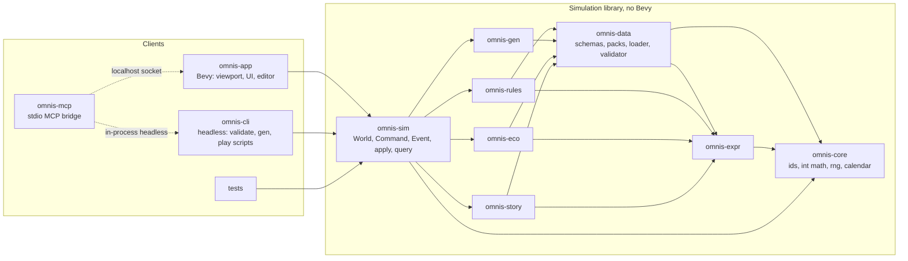
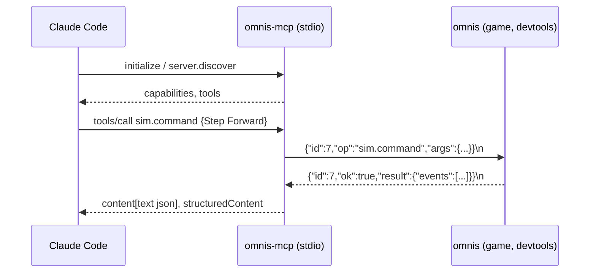

# Omnis — Architecture

| | |
|---|---|
| Status | Draft v0.2, reviewed by owner; derived from `PRD.md` v0.3 |
| Date | 2026-09-11 |
| Owner | john@gatewaynode.com |
| Scope | How the system is built. What and why live in `PRD.md`. |

Every section cites the PRD goal, decision, or constraint it serves. When this document and the PRD disagree, the PRD wins and this document is wrong.

---

## 1. Principles

These follow from PRD goals 2, 3, 7 and constraints §11, and from the owner's direction that rules will be tweaked heavily and features will keep arriving.

1. **The simulation is a library.** Rules, world state, combat, exploration, ecosystem, and story run as pure Rust with no Bevy, no I/O, no wall clock, no threads. Input is a command; output is a list of events. Everything else (renderer, editor, MCP, CLI, tests, future co-op) is a client of that library.
2. **Everything is data, including formulas.** Content is RON. Rule formulas are Rhai expressions in RON, evaluated by a strictly sandboxed engine. Changing a number or a formula never requires a rebuild.
3. **Events are the only way out.** The simulation never calls a client. Clients read the event log and query the world. This is what makes replay, tests, MCP, and co-op the same problem.
4. **Boundaries are crates.** Cargo enforces the dependency direction; a crate that must not know Bevy cannot import it.
5. **Thin adapters at every edge.** Bevy is wrapped once, in one crate. MCP is a separate binary that speaks a private protocol to the game. Both can be replaced without touching the simulation.
6. **Untrusted input everywhere.** Packs, saves, socket messages, and expressions are validated with limits before use (PRD §11.3, R8).
7. **Small files, small crates.** Files at or under 1000 lines; a crate does one thing (`CLAUDE.md`).

## 2. System overview



The game loop, in words: a client turns player input into a `Command`; `omnis-sim::apply` mutates the `World` and returns `Vec<Event>`; the client renders the events and the new state. The MCP bridge is just another client that sends commands and queries over a socket.

## 3. Workspace and crates

Cargo workspace at the repository root. Crates under `crates/`. Names use the `omnis-` prefix; binary names are `omnis`, `omnis-cli`, `omnis-mcp`.

| Crate | Kind | Purpose | Allowed dependencies |
|---|---|---|---|
| `omnis-core` | lib | Typed IDs, integer and fixed-point math, dice, deterministic RNG (own PCG32), calendar and time, ordered collection aliases, error type. | `serde` |
| `omnis-expr` | lib | Sandboxed rule scripting host on Rhai: engine profiles, slot compilation and validation, evaluation with named RNG streams, hot swap. | `rhai`, `serde` |
| `omnis-data` | lib | Schema structs for every content type, pack manifest, pack loader, ID registry and interning, validation with limits, schema versions and migrations, RON read and write. | `core`, `expr`, `serde`, `ron` |
| `omnis-rules` | lib | SRD-derived mechanics as pure functions: character build, checks, attacks, saves, damage and conditions, spell points and components, leveling, rest. | `core`, `expr`, `data` |
| `omnis-gen` | lib | Procedural generation layers producing ordinary map and region data. | `core`, `data` |
| `omnis-eco` | lib | Regional ecosystem state, typed region events, daily tick. | `core`, `expr`, `data` |
| `omnis-story` | lib | Quest graphs, quest templates, static completability check, journal. | `core`, `expr`, `data`, `eco` (types only) |
| `omnis-sim` | lib | The orchestrator: `World`, `Command`, `Event`, `apply`, `query`, save and load, replay. Owns exploration, visibility, combat state machine, towns, party, time. | all of the above |
| `omnis-app` | bin `omnis` | Bevy application: presentation, input, audio, editor, pack asset loading, dev socket server. The only crate that imports Bevy. | `sim` and Bevy |
| `omnis-cli` | bin `omnis-cli` | Headless tool: validate packs, generate worlds, render maps as text, run command scripts, replay saves, dump schemas, bake tileset sprites. Also exposes a library so `omnis-mcp` can run headless. | `sim`, `data`, `core`, `png` (M1: the loader and the bake tool need them directly) |
| `omnis-mcp` | bin `omnis-mcp` | MCP bridge: JSON-RPC over stdio to Claude Code, private protocol to the game socket, or in-process headless via `omnis-cli`. | `serde_json`, `omnis-cli` (lib) |

Rules the dependency graph enforces:
- Nothing below `omnis-app` may depend on Bevy. CI greps `Cargo.lock` paths to prove it.
- `omnis-gen`, `omnis-eco`, `omnis-story`, `omnis-rules` are leaves that never import each other, except `story` reading `eco` types. Cross-cutting flows go through `omnis-sim`.
- Only `omnis-data` reads or writes files. Everything else receives loaded data.

## 4. Simulation model (`omnis-sim`)

Serves PRD goal 7 (determinism), D5 (co-op later), and the MCP requirement.

### 4.1 World

```rust
pub struct World {
    pub schema: u32,                 // save schema version
    pub packs: Vec<PackFingerprint>, // id, version, content hash
    pub rng: Pcg32,                  // state and stream counter, serialized
    pub clocks: BTreeMap<HolderId, Clock>,       // subjective time per holder (§4.4); no global clock
    pub contacts: BTreeMap<(HolderId, HolderId), Contact>,
    pub party: Party,                // up to 6 members (D10), gold, gems, food, inventory
    pub position: Position,          // map, tile, facing
    pub maps: BTreeMap<MapId, MapState>,   // mutable per-map state; static tiles come from data
    pub regions: BTreeMap<RegionId, RegionState>,
    pub automap: Automap,            // per-map known tiles with layer bits and seen-at time
    pub quests: QuestState,
    pub mode: Mode,                  // Explore | Combat(CombatState) | Town(ServiceState) | ...
    pub flags: BTreeMap<FlagId, i64>,
    pub settings: Difficulty,        // save rule, permadeath (D17)
}
```

- All collections are ordered (`BTreeMap`, `Vec`); iteration order is part of determinism.
- All numbers are integers. Ratios use `core::Fixed` (i64 with 1/1000 scale) where needed. No `f32` or `f64` anywhere in the simulation crates; CI denies the types with a lint.
- The world is `serde::Serialize + Deserialize`; a save is the world in RON (D15), optionally compressed on disk.
- `World::fingerprint()` hashes the canonical serialization; equal fingerprints on two platforms is the determinism test.

### 4.2 Command and Event

```rust
pub enum Command {
    Step(Direction),            // forward or back
    Turn(Rotation),
    Interact,                   // door, sign, NPC, trigger on the facing tile
    Rest,
    Party(PartyCommand),        // create, reorder, exchange, dismiss hireling
    Service(ServiceCommand),    // inn, temple, trainer, smith, tavern, bank, guild
    Combat(CombatCommand),      // per actor: attack, cast, use, dodge, exchange, run
    Encounter(EncounterChoice), // attack, bribe, hide, run
    Cast(SpellCast),            // out of combat
    UseItem(ItemUse),
    Sense(SenseSource),         // spyglass, scouting, divination (PRD §7.2)
    Journal(JournalCommand),
    Dev(DevCommand),            // feature "devtools" only: teleport, set flag, tick eco, set rule
}

pub enum Event {
    Moved { from: Position, to: Position },
    Blocked { reason: BlockReason },
    TimeAdvanced { holder: HolderId, minutes: u32, day_rolled: bool },
    Reconciled { a: HolderId, b: HolderId, delta_a: i64, delta_b: i64, era_b: EraId },
    Visible { tiles: Vec<SeenTile> },        // what the party perceives this turn
    EncounterStarted { stacks: Vec<StackRef>, surprise: Surprise },
    Initiative { order: Vec<ActorRef> },
    AttackResolved { attacker, target, roll: RollTrace, outcome },
    Damage { target, amount, kind },
    Condition { target, condition, applied: bool },
    SpellCast { caster, spell, points, components_consumed },
    Death { target },
    CombatEnded { outcome, xp, loot },
    LevelUp { member, level, gains },
    Region(RegionEvent),                     // from omnis-eco
    Quest(QuestEvent),                       // from omnis-story
    Message { key: TextKey, args: Vec<Arg> }, // localized by clients
    Door { map, x, y, facing, open },        // M1 addition: a door changed state
    Saved, Loaded,
}
```

- `apply(&mut World, &Data, Command) -> Result<Vec<Event>, Rejection>`. A `Rejection` is a rule refusal (not your turn, cannot afford, tile blocked) and is not an error; errors are bugs.
- Every dice roll produces a `RollTrace` in the event so a client can show the math and a test can assert it.
- Events are appended to `World::log` (bounded ring in release, unbounded in dev) so MCP `events.tail` and replay work.
- Text never appears in events; only keys and arguments. Clients localize from pack `text/`.

### 4.3 Query

Read-only views for clients: `query::party(&World)`, `query::viewport(&World, &Data) -> ViewportModel` (the tiles within visibility depth, with detail-depth cut, see §8.3), `query::automap(map)`, `query::region(id)`, `query::journal()`, `query::path(&World, "party.members[0].hp")` for MCP's generic inspector. Queries never mutate and never roll dice.

### 4.4 Subjective time

Source: `docs/background/introduction.md`. In Toel, time is local to each traveller and converges only briefly when people meet; the standard greeting is a question about how much time has passed for the other person. This is not flavour on top of a global clock. The architecture has no global clock.

**Temporal holders.** Every entity that experiences time carries its own clock.

```rust
pub struct Clock {
    pub elapsed: i64,          // subjective minutes since the holder's origin
    pub era: EraId,            // which age of the world this holder is living in; one era in v1 content
}
pub struct Contact {
    pub other: HolderId,
    pub self_elapsed: i64,     // my clock when we last met
    pub other_elapsed: i64,    // their clock when we last met
}
pub enum HolderId { Party(PartyId), Region(RegionId), Actor(ActorId), Character(CharacterId), Project(ProjectId) }
```

Holders in v1: the party (one clock shared by its members while they travel together), every region (owning its maps, lairs, respawns, and ecosystem state), every named actor (empty in v1 content, filled by NPC agency later), and characters who are separated from the party (a dismissed hireling waiting at an inn ages on their own clock). Construction projects and other player parties are holders the model already admits (§4.4, "What this buys").

**Advancing.** A command advances only the clock of the holder that acted. A step, a rest, or a service advances the party's clock by data-defined minutes and emits `TimeAdvanced { holder, minutes }`. Nothing else in the world moves. The player's calendar (year, day of 360, minute of 1440; shape is data) is a rendering of the party's own elapsed time, and night is a predicate on it.

**Reconciliation.** When two holders interact, their clocks reconcile, and only somewhat. Interactions are explicit in the simulation: the party enters a region, meets an actor, opens a project, or two parties meet. On interaction between `a` (the initiator) and `b`:

1. Look up the last `Contact` between them, or treat `b` as never met.
2. `delta_a` = how much `a` has experienced since that contact.
3. `delta_b` = `reconcile(delta_a, stability_b, coupling_ab, rng)`, a rule expression in data. The v1 base rule is a ratio around 1 with a jitter drawn from the named RNG stream `time:<a>:<b>`, bounded by the region's temporal stability: a stable town might drift by a few percent, a ruin in flux by months. `delta_b` is never negative in v1.
4. `b` catches up by `delta_b`: a region runs its ecosystem catch-up (§7.3), respawns, and project progress for that much time; an actor runs their agency catch-up (later).
5. Both `Contact` records are updated and the simulation emits `Reconciled { a, b, delta_a, delta_b, era_b }`. The greeting in the background text is a `Message` whose arguments are exactly those two deltas.

Holders that are not part of the interaction do not move. A region the party has not visited for a year of subjective time has experienced nothing yet; it experiences its share when the party returns. This is "the world changes without the player" from PRD goal 4, delivered lazily and deterministically.

**Coupling between non-party holders.** Regions declare couplings in data (a road, a trade route, a river). When a region reconciles with the party, it also reconciles once with each coupled region using the same rule, so migration and trade flow across a neighbourhood without a world-wide tick. Coupling depth is one in v1 and is data.

**Eras.** `EraId` on a clock and `BTreeMap<EraId, RegionState>` on a region let a reconciliation land the party in a different age of the same place: the ruin encountered alive, the kingdom that vanished overnight. In v1 content every holder is in the single era `present` and the reconciliation rule never changes era; the data model and the event carry the field so that content and rules can use it later without a save migration.

**Combat and shared clocks.** During an encounter, all combatants share the encounter's clock; reconciliation happens once at encounter start. Party members share the party clock; a member who leaves becomes a holder with a copy of the party's clock at that moment.

**Determinism.** Reconciliation jitter draws from named RNG streams per holder pair, so an added interaction elsewhere does not perturb it. Catch-up of `delta_b` days is bounded: ecosystem catch-up runs in coarse steps (§7.3), and a cap per reconciliation (data, default 10 years) prevents pathological work.

**What this buys.** NPC agency: an actor is a holder with a clock; their off-screen life is catch-up at contact. Multiplayer: each party is a holder; parties reconcile when they meet, and no global tick has to be agreed between players. Construction and travel: a project is a holder whose progress is its reconciled time times a rate; a long journey is the party's clock advancing, then reconciling on arrival. Aging: a character's age is subjective elapsed time, which is why members separated from the party keep their own clocks.

**What it costs.** Every interaction site in the simulation must call reconcile; forgetting one leaves a holder frozen. The interaction points are enumerated in `omnis-sim::time` and tested: region entry, actor meeting, project inspection, party meeting, encounter start.

### 4.5 Combat state machine

`Mode::Combat(CombatState)` holds initiative order, the party rows, monster stacks in order, per-actor resources this round, and round count. Transitions: `Encounter → (choice) → Combat → (all stacks dead | party fled | party dead) → Explore`. Each `CombatCommand` is validated against whose turn it is. Monster turns are resolved by `omnis-rules::monster_ai` when the next actor is a monster, before returning events, so one player command may produce many actors' worth of events.

### 4.6 Replay and co-op readiness

A `Replay` is `(initial World fingerprint, pack fingerprints, Vec<Command>)`. Applying the commands to the same initial world must reproduce the final fingerprint; this is a CI test. Networked co-op later is "share the command stream", which is why commands carry no client-side state.

## 5. Rule scripting host (`omnis-expr`, Rhai)

Serves the owner's direction that rules will change a lot, PRD goal 2, and D12 (formula is data). Owner decision (A4, revised 2026-09-12): rule formulas are written in Rhai rather than a hand-rolled language. `omnis-expr` keeps its name and its place in the crate graph; its job changes from implementing a language to hosting one under strict configuration. Facts about Rhai below were verified against its repository, book, and crates.io on 2026-09-12.

### 5.1 What `omnis-expr` owns
- **Engine construction.** One `Engine::new_raw()` per profile, with only the packages we choose registered: arithmetic and logic, plus our own `min`, `max`, `clamp`, `abs`, `floor_div`, and `d(n, sides)`. `new_raw` starts with no built-in functions, so nothing enters the sandbox by default.
- **Profiles.** `Formula` is the only profile in v1: a single expression per slot, no statements. `Script` is the later profile for quest logic (PRD §13, "scripting for mods") with functions, arrays, and maps enabled and higher limits; it is designed for but not built.
- **Slots and inputs.** Every rule slot declares its input names and types in `omnis-data`. `omnis-expr` compiles each slot's source to an `AST` at pack load and checks that every variable the AST references is a declared input, by walking the AST (Rhai's `internals` feature) or, if that API proves unstable, by a dry-run evaluation with all inputs bound. Unknown identifiers are pack validation errors with file, line, and column.
- **Evaluation.** `eval(slot, inputs, rng_stream) -> Result<i64 | bool, RuleError>` builds a `Scope` from the inputs, binds the RNG stream for `d`, and runs `eval_ast_with_scope`. A `RuleError` is a bug or bad data, never a rejection; it names the slot and the Rhai error.
- **Hot swap.** `set_slot(slot, source)` recompiles and replaces the AST in place (dev builds, via MCP `rules.set`). ASTs are not serializable, so packs and saves carry source text and every load recompiles.

### 5.2 Build features and sandbox limits
Rhai features enabled for the v1 formula build: `only_i64` (one integer type), `no_float` (no floating point exists in the language), `sync` (ASTs and closures are `Send + Sync`, required because compiled rules live in a Bevy resource), `no_time`, `no_custom_syntax`, `no_function`, `no_closure`, `no_module`, `no_index`, `no_object` (no user functions, closures, imports, arrays, or maps in formulas). The `unchecked` feature is never enabled: integer overflow and division by zero are runtime errors, not wraps. Enabling the `Script` profile later means removing the last five flags in one rebuild; the `Formula` profile keeps enforcing its subset through `disable_symbol` regardless.

Engine limits per profile:

| Limit | Formula | Script (later) |
|---|---|---|
| `disable_symbol` | `fn`, `loop`, `while`, `for`, `do`, `let`, `const`, `import`, `export`, `eval`, `throw`, `try`, string literals | `import`, `export`, `eval` |
| `set_max_operations` | 10 000 | 1 000 000 |
| `set_max_expr_depths` | (32, 16) | (64, 32) |
| `set_max_call_levels` | 8 | 32 |
| `set_max_string_size`, `array_size`, `map_size` | 0 (types unavailable) | 4 KB, 4 096, 1 024 |

### 5.3 Determinism
- Integers only, checked arithmetic, `only_i64`: results are identical on every platform. `/` truncates toward zero and `%` follows the sign of the dividend, matching Rust; rule authors are told this in the pack documentation.
- `d(n, sides)` draws from the named RNG stream passed in by the caller (§11), so dice in formulas are deterministic and appear in `RollTrace`.
- Rhai's `Map` is a `BTreeMap`, so map iteration is ordered; it is unavailable in the formula build anyway.
- Rhai randomizes its internal function-lookup hashing seed per process unless `set_hashing_seed` is called; `omnis-expr` sets a fixed seed before the first engine is built. This affects only lookup internals, not script results, and is set for hygiene.

### 5.4 Cost and security
- Performance: Rhai is an AST interpreter, published at roughly two to three times slower than CPython on its own benchmarks. A ten-operation formula costs on the order of a microsecond. Combat with fifty rolls per round is negligible. Ecosystem catch-up is the heavy case: a region catching up a subjective year at fifty coarse ticks and twenty rules per tick is about a thousand evaluations, a few milliseconds. Only regions in contact do this work (§4.4).
- Security (R8): the formula build has no I/O, no modules, no functions, no strings, no time, bounded operations and depth, and checked arithmetic. A mod pack can make a rule slow or wrong; it cannot reach the filesystem, the network, or the process. The `Script` profile, when it comes, keeps the no-I/O guarantee and adds only computation.
- Dependency footprint: `rhai` pulls `smallvec`, `thin-vec`, `ahash`, `num-traits`, `once_cell`, `bitflags`, `smartstring`, and the `rhai_codegen` proc-macro crate. `smartstring` is MPL-2.0; it is file-scoped copyleft, compatible with linking into MIT or Apache-2.0 code, and is listed in the attribution file. Several of these crates are already in Bevy's tree and must resolve to Bevy's versions (§12).

### 5.5 Example rule slot (data, not code)
```ron
// packs/base/data/rules/casting.ron
(
  schema: 1,
  spell_points: (
    inputs: ["level", "cast_mod", "other_mental_mods", "half_caster"],
    pool: "max(level, (if half_caster { level / 2 } else { level }) * cast_mod + other_mental_mods)",
    cost: "spell_level",
  ),
  component_threshold: 5,
)
```

## 6. Data model and packs (`omnis-data`)

Serves PRD goals 2 and 3, D3, D15, §10, §11.3.

### 6.1 Pack layout
```
packs/<pack_id>/
  pack.ron            # manifest: id, version, name, license, attribution, depends, schema
  data/
    races/*.ron  classes/*.ron  backgrounds/*.ron  spells/*.ron  monsters/*.ron
    items/*.ron  conditions/*.ron  tiles/*.ron  maps/*.ron  regions/*.ron
    quests/*.ron  templates/*.ron  eco/*.ron  rules/*.ron  tables/*.ron
  text/<lang>/*.ron   # TextKey -> string with {arg} placeholders
  assets/
    tilesets/  sprites/  ui/  fonts/  audio/
```
- Every data file is one RON struct with a `schema: u32` field first. Migrations are functions `vN -> vN+1` registered per type; loading an old schema runs them in order and reports it.
- IDs are strings `pack:type:name` in files and are interned to `u32` newtypes (`SpellId`, `MonsterId`, ...) in a `Registry` at load. Unknown references are load errors with the referencing file named.
- Later packs override earlier packs by ID. The manifest declares `depends: ["base >= 1.0"]` and load order is a topological sort; cycles are errors.
- The base campaign is `packs/base`. A mod is any other directory in the user's packs folder. The editor writes the same format.

### 6.2 Validation as untrusted input
Applies to packs, saves, and anything crossing the dev socket.
- Path normalization; any component of `..`, absolute paths, or symlinks out of the pack root is rejected.
- Size limits per file (4 MB text), per pack (256 MB), per map (256×256 tiles), per collection (65 536 entries), per string (4 KB).
- Asset extensions whitelisted; images are decoded with dimension caps before upload.
- RON is parsed with a recursion limit. Expressions have the limits in §5.2.
- Every error is collected, not short-circuited; the report lists all of them with file and line. The game never panics on bad data; it refuses the pack.

### 6.3 Attribution
`pack.ron` carries `attribution: [(source, license, text)]`. The base pack carries the SRD 5.1 CC-BY-4.0 notice (PRD §11.2). The credits screen renders every loaded pack's attribution.

## 7. World, generation, ecosystem, story

### 7.1 Map and world graph
- A **map** is a rectangular tile grid up to 256×256 with a tile type per cell, a wall mask per edge (N, E, S, W), objects, triggers, and a kind (outdoor, town, dungeon, special). MM2's 16×16 is a size, not a rule.
- A **region** is an ecosystem unit that owns one outdoor map and any number of sub-maps (towns, dungeons). Regions tile the world in a grid; region edges link to neighbours.
- Maps link through **portals** (stairs, doors, edges, teleporters), each a typed tile trigger.
- A map or region may be `Materialized(data)` or `Pending { seed, params }`. The simulation materializes on first entry by calling `omnis-gen` and stores the result in the save. Nothing else distinguishes generated from authored content (PRD §9.1).

### 7.2 Generation (`omnis-gen`)
Layered pipeline, each layer a pure function `(seed, params, prior layers) -> layer data`, run from a per-layer sub-seed so re-running one layer does not change the others: terrain → hydrology and roads → settlements → dungeons → encounters and loot → quest hooks. Each layer output is ordinary `omnis-data` structs. A `LockMask` per map marks tiles the editor has hand-edited; regeneration of a layer skips locked tiles. Golden tests pin seed → fingerprint on all CI platforms.

### 7.3 Ecosystem (`omnis-eco`)
Serves PRD §9.2 and the NPC-agency forward compatibility requirement.
```rust
pub struct RegionState {
    pub populations: BTreeMap<CreatureGroupId, u32>,
    pub factions: BTreeMap<FactionId, FactionStanding>,
    pub resources: BTreeMap<ResourceId, u32>,
    pub prosperity: u32, pub danger: u32, pub weather: WeatherState,
    pub actors: BTreeSet<ActorId>,     // named entities present; empty in v1 content
    pub stability: u32,                // temporal stability for reconciliation (§4.4); data
    pub couplings: Vec<RegionId>,       // regions that reconcile alongside this one (§4.4)
}
pub enum RegionEvent { PopulationChanged, FactionShift, ResourceChanged, WeatherChanged, ActorMoved, ActorActed, Derived(Outputs) }
```
- State changes only through `apply_region_event`. Rules in `data/eco/*.ron` are expressions over region inputs that emit events. Player actions that touch a region (clearing a lair, trading) are emitted by `omnis-sim` as region events through the same path.
- `tick(region, neighbours, rules, rng, dt_days)` runs ordered phases: environment, populations, factions, actors (no-op in v1), economy, derived outputs. Adding NPC agency later inserts logic into the actors phase without changing the others.
- Ticks are driven by reconciliation (§4.4), not by a global day. `catch_up(region, delta_days)` runs `tick` with `dt_days` up to a data-defined coarse step (default 7) until the delta is consumed, so a region that receives a year runs about fifty coarse ticks, not 360 fine ones. Rules are written per day and scale by `dt_days`; the golden tests include a fine-versus-coarse equivalence check within tolerance.
- Derived outputs (encounter table weights, price multipliers, rumor keys, generated quest availability) are recomputed each tick and read by `omnis-sim` and `omnis-story`.
- Budget: a region catching up a subjective year is about a thousand rule evaluations, a few milliseconds (§5.4); only regions in contact do work (PRD §9.2).

### 7.4 Story (`omnis-story`)
- **Quest graph**: nodes (`Dialogue`, `Choice`, `Check`, `SetFlag`, `Reward`, `Spawn`, `MapChange`, `End`) with edges guarded by expressions over `{flags, party, party clock, region, quest}`. Stored in `data/quests/*.ron`, edited in the editor's graph view.
- **Static check** at pack load: every node reachable from start reaches an `End`; every `Check` has both outcomes wired; every referenced flag, item, monster, and map exists. Failures are validation errors (PRD §9.3).
- **Templates** in `data/templates/*.ron` declare `requires` (bindings: a town, a dungeon within N regions, a creature group with population above X), `instantiate` (the graph to stamp with bindings substituted), and `effects` (region events on completion). `omnis-sim` asks `omnis-story` for candidate templates in a town each tick and instantiates deterministically from the world RNG.
- The journal is a query over `QuestState`.

## 8. Presentation (`omnis-app`)

Serves D2, D16, PRD §7.2, R2, R10. Bevy facts verified against 0.19.1 sources on 2026-09-11.

### 8.1 Structure
- One Bevy `App` with plugins per concern: `SimPlugin` (owns the `World`, applies commands, publishes events), `InputPlugin` (maps keys and gamepad to `Command`), `ViewportPlugin`, `HudPlugin`, `MenusPlugin`, `AudioPlugin`, `EditorPlugin`, `DevSocketPlugin` (feature `devtools`), `PackAssetPlugin`.
- Bevy features: `default-features = false, features = ["2d", "ui", "png"]`, plus `audio` when sound arrives. The `3d` group (pbr, gltf) is never enabled. A `dev` feature enables `bevy/dynamic_linking`, `bevy_dev_tools`, and `file_watcher`; it is never shipped.
- App states (`bevy_state`): `Boot → MainMenu → {NewGame, Load} → Playing | Editor`, with `SubStates` under `Playing`: `Explore | Encounter | Combat | Service | Journal | Paused`. `OnEnter` and `OnExit` build and tear down presentation entities per state.
- The `World` is a Bevy `Resource` wrapped in `SimWorld` (in 0.19 resources are components on singleton entities; `Res` and `ResMut` are unchanged). Only `SimPlugin` systems mutate it, in one ordered system set in `Update`: `collect commands → apply → push events`. All other systems read events from a buffered `Message` queue (`MessageWriter`/`MessageReader`, 0.19's name for the old buffered events) and read the world through `query::*`. Bevy's ECS holds presentation entities only (sprites, UI nodes, sounds); it never holds game state.
- Simulation events are re-published as Bevy messages one to one; observers (`On<E>`) are used only for presentation-internal triggers (a floating number finished, a menu closed).
- Events drive animation. A `Damage` event spawns a floating number; `Moved` starts a step transition; `Visible` updates the viewport model. Presentation may lag the simulation by an animation queue, but the simulation is never blocked by it.

### 8.2 Pixel pipeline
- Fixed internal resolution (PRD §14, to decide with art; placeholder 320×180 or 480×270) using the pattern from Bevy's `pixel_grid_snap` example: an inner `Camera2d` rendering to an `Image` target on its own render layer with MSAA off, an outer camera showing that canvas as a sprite, and a resize system that sets the outer projection scale to the reciprocal of the rounded minimum of the horizontal and vertical scale factors, which yields integer scaling. `ImagePlugin::default_nearest()` for all sampling. UI text renders on the outer camera at native resolution so it stays readable.
- Asset loading: `omnis-data` loads packs to structs outside Bevy's asset system, because packs are validated data, not assets. A small custom `AssetLoader` (0.19 signature: async `load(reader, settings, load_context)`) handles only pack images and audio by pack-relative path into `Handle<Image>` and atlases. No RON goes through Bevy's asset system; Bevy has no generic RON loader and does not need one here. Missing assets resolve to a generated magenta placeholder (PRD §10).

### 8.3 Viewport contract (D16)
- `query::viewport` returns a `ViewportModel`: a forward cone of tiles up to visibility depth, each with terrain, wall mask, objects, monsters, light, and a `distance`.
- The renderer draws rows `0..detail_depth` (fixed, 4–6) from the tileset's per-depth sprite slots: for each depth `d` and lateral offset `o` in `-d..=d` (clamped to the tileset's width), slots `floor`, `ceiling`, `wall_front`, `wall_left`, `wall_right`, `door`, `object`, `monster`. A tileset declares `detail_depth` and `width`; that is the whole art contract, so art scope is bounded (R10). M1 note: each slot also carries its `x`/`y` position on the tileset's declared `viewport` canvas, so baked and hand-drawn slots place themselves; `omnis-cli tileset bake` generates slots from flat textures (`tasks/TODO.md` M1 review). M1 follow-up: two more slot kinds, `block` (solid terrain such as a pillar: its near face plus the side face toward the party; named by `Terrain.block`) and `door_open` (an open door's frame; named by `MapDef.door_open`), both optional in the data.
- Rows beyond detail depth up to visibility depth are drawn as a horizon band: one column per lateral position, a terrain colour swatch plus optional landmark silhouette sprite, height falling with distance. Procedural, not sprite art.
- Visibility depth per tile comes from the simulation (environment, light, weather, abilities), not from the renderer.

### 8.4 Editor
- Lives in the `Editor` app state in the same binary. Edits `omnis-data` structs in memory and writes RON through `omnis-data`; the loader and the writer are the same code path (PRD §10).
- Views: tile map (paint terrain, edges, objects, triggers, lock mask), region (state and rules), quest graph, data tables, procgen panel (generate, regenerate a layer, lock), text keys, and a playtest button that builds a `World` from the in-memory pack at the cursor tile.
- UI toolkit (A11): `bevy_egui` for the editor only, pinned at 0.41.1 for Bevy 0.19. Immediate-mode tables, property panels, docking, and node-graph widgets make the editor views cheap to build and change. Player-facing HUD and menus use first-party `bevy_ui` so the game keeps its pixel look; Feathers widgets are used there only where they fit (text and number inputs in character creation) and are treated as experimental. `bevy_egui` is confined to `EditorPlugin` so a lag at each Bevy release stalls only the editor build, and the editor can be feature-gated off if a release lags badly (R2).

## 9. Dev socket and MCP (`omnis-app` feature `devtools`, `omnis-mcp`)

Serves the owner's requirement to interact with the live game as it is built. Design follows the decision: own minimal MCP, stdio bridge, private socket protocol.



### 9.1 Game side
- `omnis --dev-socket [addr]` (feature `devtools`, on by default in debug builds, compiled out of release builds) listens on `127.0.0.1:0` by default and writes the bound address to `.omnis/dev.addr` in the working directory; the bridge reads that file. Loopback only, one client at a time, no auth beyond loopback in v1; an optional shared token file is a later addition.
- Transport: TCP, newline-delimited JSON, one request per line, one response per line, `{"id", "op", "args"}` → `{"id", "ok", "result" | "error"}`. No async runtime; a Bevy system polls a non-blocking listener each frame, reads complete lines, dispatches on the main thread with full access to the world, and writes responses. Long operations (tick 1000 days) run in bounded slices across frames and report progress.
- Ops mirror MCP tools one to one, so the bridge is a pure translator.

### 9.2 Bridge
- `omnis-mcp` speaks MCP JSON-RPC 2.0 over stdio, one message per line, stdout only for protocol, logs to stderr, exits on stdin EOF.
- **Dual era.** The 2026-07-28 spec revision removed `initialize`, `notifications/initialized`, and `ping` in favour of `server/discover` with per-request `_meta`; whether Claude Code speaks the new revision is unverified as of writing. The bridge answers both: legacy `initialize` (echoing a supported version) and modern `server/discover`; `tools/list` and `tools/call` shapes are common to both, with `resultType: "complete"` and `ttlMs`/`cacheScope` added when the modern era was negotiated.
- Registration: `.mcp.json` at project scope with `{"mcpServers": {"omnis": {"command": "${CLAUDE_PROJECT_DIR}/target/debug/omnis-mcp"}}}`.
- Modes: `omnis-mcp` (connect to the running game via `.omnis/dev.addr`) and `omnis-mcp --headless [pack...]` (run the simulation in-process through `omnis-cli`'s library, no window, for fast rule testing and CI-style checks).

### 9.3 Tool set (v1)
| Tool | Purpose |
|---|---|
| `game.status` | mode, party clock and calendar, position, packs, fingerprint |
| `time.clocks`, `time.reconcile` | list holder clocks and contacts; force a reconciliation between two holders (dev) |
| `world.query` | read any path (`party.members[0].hp`) |
| `party.get`, `party.create` | inspect and build a party from data |
| `sim.command` | apply one `Command`, return events with roll traces |
| `sim.script` | apply a list of commands |
| `events.tail` | last N events |
| `viewport.get`, `map.text` | the viewport model; a map rendered as text with the party marker |
| `automap.get` | known tiles with layers and seen-at |
| `rules.list`, `rules.get`, `rules.set` | inspect and hot-swap expression slots |
| `pack.validate`, `pack.reload` | run the validator; reload packs into the running game |
| `eco.region`, `eco.tick` | region state; advance N days |
| `story.state`, `story.check` | quest state; run the static check |
| `save.write`, `save.read` | snapshot to and from a path |
| `screenshot` | PNG of the window as image content (game mode only) |
| `editor.*` | later: open map, paint, place, lock |

Every tool has a JSON Schema `inputSchema` generated from the Rust argument types so the bridge, the socket, and the docs cannot drift.

## 10. CLI (`omnis-cli`)

Headless, Bevy-free, fast to compile. Subcommands: `validate <packs>`, `schema dump`, `gen region --seed --params`, `map text <map>`, `play --script <file>` (runs commands, prints events), `replay <save> <commands>` (asserts fingerprint), `bench eco --regions N --days D`. CI uses it for golden and determinism tests. It exposes `omnis_cli::Headless` for the MCP bridge.

## 11. Determinism and testing

Serves PRD goal 7, §11.1, R6, R9, and `CLAUDE.md` verification rules.
- **RNG and seeds** (A14, approved 2026-09-12):
  - **One world seed**, `u64`, fixed at new game. The app layer offers a text seed (hashed with FNV-1a 64) or draws one from OS entropy; the simulation never touches entropy and only ever receives the number. The seed is shown on the new-game and save screens so worlds can be shared, and it is stored in the save.
  - **Named streams.** Every consumer draws from a stream identified by a canonical name. A stream's initial state is a pure function of the world seed and the name: `state = splitmix64(world_seed ^ fnv1a64(name))`, `increment = splitmix64(fnv1a64(name)) | 1`. Stream names in v1: `party`, `combat`, `time:<a>:<b>` (holder IDs in canonical order), `eco:<region>`, `story:<region>`, `gen:<x>:<y>:<layer>`. Adding a stream never perturbs an existing one; adding a draw inside a stream perturbs that stream's later draws only, and golden tests are re-baselined in the same commit.
  - **Stateful streams are persisted.** `World.rngs: BTreeMap<StreamName, Pcg32>` holds every stream that has been used, with its state and draw count, so a loaded save continues exactly. A stream absent from the map is created on first use from the formula above, which is why lazily generated regions and never-met holders cost nothing until touched.
  - **Generation streams are stateless.** `omnis-gen` derives each layer's stream fresh from `gen:<x>:<y>:<layer>` and never persists it, so regenerating a layer is a pure function of seed, coordinates, and parameters regardless of play history. Locked tiles are re-applied after generation.
  - **Dice in formulas** draw from the stream of the calling subsystem, passed in the evaluation context; a combat roll and an ecosystem roll never share a stream.
  - **Every draw is traceable.** `RollTrace` records stream name, draw index, and raw output; a replay divergence therefore names the first stream and index that differed.
  - **Hashing is our own.** FNV-1a 64 and splitmix64 are a few lines each in `omnis-core`. `std::hash::DefaultHasher` and any randomized hasher are banned from the simulation crates because their output is unspecified across Rust versions and, for randomized hashers, across runs.
  - **Later**: multiplayer shares the world seed and gives each party its own `party:<id>` stream.
- **No floats** in simulation crates, enforced by a CI lint. Ordered collections only.
- **Test tiers**:
  1. Unit tests in each leaf crate on real pack data (`packs/test`), no mocks.
  2. Golden tests: seed → fingerprint for gen and eco; a change must be intentional and re-baselined in the same commit.
  3. Replay tests: recorded command scripts under `tests/replays/` reproduce fingerprints; run on macOS and Linux in CI.
  4. Save round-trip: load every fixture save, save, compare fingerprints; migration fixtures for each schema version.
  5. Pack validation corpus: known-bad packs must be rejected with the expected error list.
  6. App smoke tests with `MinimalPlugins` and `ScheduleRunnerPlugin::run_once()` (no window, no GPU): boot to main menu, start a game, step once, no panics. These are the only tests that touch Bevy.
- Every bug fix ships with a failing-then-passing test (`CLAUDE.md`).

## 12. Security

- Packs, saves, socket input: §6.2 limits and normalization; never panic, always report.
- Scripts from data run only in the Rhai formula profile (§5.2): no I/O, no modules, no functions, no strings, bounded operations and depth, checked arithmetic.
- Dev socket: loopback only, compiled out of release, single client, request size cap (1 MB), op allowlist. `Dev` commands are rejected by `apply` unless the world was created with `devtools` enabled.
- Saves record pack fingerprints; loading with different packs warns and refuses unless forced.
- Dependencies: pinned exact versions in `[workspace.dependencies]`; `Cargo.lock` committed. Policy, in priority order (owner direction 2026-09-12):
  1. **Match Bevy's requirements.** Any crate Bevy already pulls (ron, serde, and so on) is pinned to the version Bevy 0.19 resolves, so the tree stays single-copy. `cargo tree --duplicates` must be empty for those crates; CI checks it.
  2. **N-1 and older than 30 days** for crates Bevy does not pull, per `CLAUDE.md`. Bevy itself is exempt (D9). Owner-granted exceptions are recorded in the §13 table with the date and reason; rhai 1.26.1 is the first.
  3. **When in doubt, audit with Socket** (`depscore`) before adding or bumping, and default to whatever Bevy requires.

## 13. Dependencies (initial)

Verified against crates.io on 2026-09-11. Policy in §12: match Bevy's resolved versions first, N-1 and 30 days for the rest, Socket audit when in doubt. Socket `depscore` audited on 2026-09-12; every crate scored 100 on license, maintenance, and vulnerability and 93 on quality, except smartstring's license score (70, MPL-2.0) and thin-vec's vulnerability score (84). Supply-chain scores: ron 100, bevy_egui 100, smallvec 100, bitflags 100, once_cell 100, thin-vec 100, rhai 1.26.1 71 (owner-reviewed, see row), serde_json 82, serde 81, ahash 82, num-traits 82, thiserror 79, bevy 74. See the rhai row for the 1.25.x anomaly.

| Crate | Pin | Used by | Note |
|---|---|---|---|
| bevy | 0.19.1 | app | D9 exemption; `default-features = false`, features `2d`, `ui`, `png` (§8.1) |
| png | 0.18.1 | cli | Added 2026-09-12 for `tileset bake`; the version Bevy's image stack resolves, so no duplicate |
| serde | 1.0.228 | all | derive |
| serde_json | 1.0.150 | mcp, app devtools | protocol only |
| ron | 0.12.2 | data | Bevy 0.19 pins `ron = "0.12"`; match its resolved version, single copy in the tree (§12) |
| thiserror | 2.0.19 | core | error derives |
| bevy_egui | 0.41.1 | app (editor only) | A11; 0.42.0 fails the 30-day rule as of writing |
| rhai | 1.26.1 | expr | A4. Owner exception to the N-1 and 30-day rule (2026-09-12): 1.26.1 was released 2026-09-10; the owner reviewed the project and release and judged it not compromised. Context: the N-1 minor, 1.25.x, scores 58 on Socket supply chain against 98 for 1.24.0 and 71 for 1.26.1, with no new dependency, build script, or file-set change to explain it; 1.26.1 also contains fixes to the optimizer, function-pointer argument order, and switch matching found while building the Grain VM. The `grain` feature is not enabled. MSRV 1.66, MIT OR Apache-2.0. Re-audit with Socket at 30 days (2026-10-10). |
| smartstring (via rhai) | Bevy's or rhai's resolved | expr | MPL-2.0, file-scoped copyleft; listed in attribution. Socket license score 70 for that reason. |

Deliberately absent: `rand` (own PCG32), `tokio` (no async), any MCP SDK, any procgen or noise crate (own value noise and hashing in `omnis-gen`). Bevy's MSRV is 1.95; the workspace sets `rust-version = "1.95"`.

## 14. Build and CI

- Workspace `Cargo.toml` with `[workspace.dependencies]` pins, `rust-version = "1.95"`, and profiles: `dev` with `opt-level = 1` for workspace crates and `opt-level = 3` for dependencies; `release` with thin LTO and one codegen unit; `bevy/dynamic_linking` in a `dev` feature for the app only. A `.cargo/config.toml` selects a fast linker where available.
- `just` or plain `cargo` aliases: `cargo run -p omnis-app`, `cargo run -p omnis-cli -- validate packs/base`, `cargo test --workspace`.
- CI (GitHub Actions, macOS and Linux; Linux deferred by owner 2026-09-12 until needed): fmt, clippy with `-D warnings`, no-float lint, `cargo test --workspace`, replay fingerprints compared across the two runners, pack validation of `packs/base`.
- Single-copy is enforced relative to Bevy: `scripts/check-duplicates.sh` compares `cargo tree --duplicates` against a committed allow list of the duplicates Bevy's own tree carries, so only duplicates we introduce fail CI. The simulation lint is `scripts/lint-sim.sh`; `omnis-core`, `omnis-rules`, `omnis-gen`, `omnis-eco`, `omnis-story`, and `omnis-sim` are `#![no_std]` so the compiler also excludes the std modules the lint bans.
- Windows builds in CI once Phase 1 is playable.

## 15. Repository layout

```
omnis/
  Cargo.toml              # workspace
  crates/
    omnis-core/  omnis-expr/  omnis-data/  omnis-rules/  omnis-gen/
    omnis-eco/   omnis-story/ omnis-sim/   omnis-app/    omnis-cli/  omnis-mcp/
  packs/
    base/                 # the campaign, authored in the editor
    test/                 # minimal fixtures for tests
  tests/
    replays/  saves/  packs-bad/
  docs/                   # references (SRD, manual), design notes
  tasks/                  # TODO, LESSONS, BUGS, CONTINUITY
  .mcp.json               # omnis-mcp registration for Claude Code
  PRD.md  ARCHITECTURE.md  README.md  CLAUDE.md
```

## 16. Phase mapping

> **Note (2026-09-12):** build order follows the milestones in `tasks/TODO.md`, which front-load `omnis-app` and `omnis-mcp` so there is a testable build early. The crate-to-phase mapping below stays as the long-range map; revisit once the milestones settle.

| PRD phase | Crates built | Exit test |
|---|---|---|
| 0 Foundation | core, expr, data, sim skeleton, cli, mcp (headless mode) | `packs/test` loads and round-trips; expression tests; MCP `game.status` headless |
| 1 Crawler loop plus editor | rules, sim complete, app (viewport, HUD, menus, editor v1), devtools socket | Phase 1 done criteria (PRD §13); MCP drives a full dungeon run |
| 2 Procedural world | gen, lazy materialization, editor procgen panel | 100-region seed traversable; golden fingerprints |
| 3 Ecosystem | eco, region events, derived outputs | lair clearance changes neighbours within a week |
| 4 Story | story, graph editor, templates | static check on the main quest; generated quests in every town |
| 5 Release | base pack content, packaging, docs | external playtest; external mod pack |

## 17. Architecture decisions

| # | Decision | Alternatives | Why |
|---|---|---|---|
| A1 | Cargo workspace of small crates with a Bevy-free simulation | Single crate with modules | Cargo enforces the boundary; faster incremental builds; CLI and MCP headless need the sim without Bevy. |
| A2 | Command in, events out; clients never called by the sim | Callbacks, ECS-driven rules | Replay, tests, MCP, and co-op all reduce to the same stream. |
| A3 | Own minimal MCP bridge over stdio, private newline-JSON socket to the game | rmcp SDK in game or bridge | Owner decision; no async runtime in the game; a few hundred lines we own; dual-era handshake because the spec just broke compatibility. |
| A4 | Rhai, integer-only, sandboxed to a formula profile, hosted by `omnis-expr` | In-house expression language (first draft); formulas in Rust; Lua | Owner decision 2026-09-12: a maintained language with a parser, optimizer, and limits already built beats a hand-rolled one; the formula profile keeps the same bounded, deterministic, no-I/O posture. Later `Script` profile serves quest scripting. |
| A5 | Integers and fixed-point only in the simulation | Floats with care | Cross-platform determinism without doubt (R6). |
| A6 | Own PCG32 with named streams | `rand` | Tiny, serializable, stream-per-subsystem isolation, one fewer dependency. |
| A7 | RON for content and saves | TOML, JSON | D15; native enums and nested structs. |
| A8 | Ecosystem state changes only through typed region events | Direct mutation | NPC agency later inserts as an event source (PRD §9.2). |
| A9 | Two-depth viewport: sprite rows to detail depth, procedural horizon band beyond | Single variable depth | D16; bounded art contract (R10). |
| A10 | Game state lives in one serializable `World`, not in Bevy ECS | ECS for game state | Save, replay, and headless become trivial; Bevy churn (R2) cannot reach game state. |
| A11 | `bevy_egui` for the editor, `bevy_ui` for the game | Feathers everywhere; egui everywhere | Owner decision (confirmed 2026-09-12): Feathers is new and not mature; the editor needs something that reaches a working state fast without being wrestled with. Tool UI productivity where it matters, first-party pixel UI for players, egui isolated to one plugin. |
| A12 | Packs bypass Bevy's asset system; only images and audio go through an `AssetLoader` | RON as Bevy assets | Packs are validated untrusted data with cross-file references; Bevy's loader is per-file and has no RON loader anyway. |
| A13 | No global clock; subjective clocks per holder, reconciled on interaction by a data rule with bounded drift | Global calendar with a world-wide daily tick | Owner direction from `docs/background/introduction.md`; makes NPC agency, multiplayer, construction, and travel the same mechanism; lazy and deterministic. Cost: every interaction site must reconcile. |
| A14 | One world seed; named PCG32 streams derived by FNV-1a and splitmix64; stateful streams persisted in the save, generation streams stateless | Single global RNG; per-entity RNG objects | Approved 2026-09-12. Isolation between subsystems, exact continuation after load, pure regeneration, traceable draws. |
