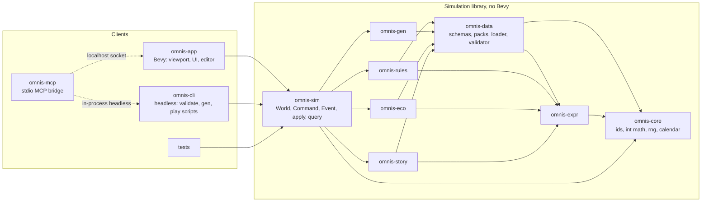
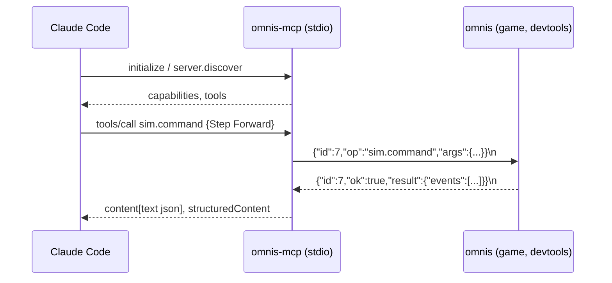

# Omnis — Architecture

| | |
|---|---|
| Status | Draft v0.7, M8 in progress (2026-10-07: the engine's API in §4.9 and A17 (two tiers, views only, a protocol version), and §4.1–§4.4, §9 and §10 brought to the code as built; 2026-10-05: §4.4 company and the party's date, §4.8 the signal bus, as planned; 2026-10-06: the bus is its own crate, `omnis-bus`, with its architecture and three designed expansions in §4.8, §3 and A16; v0.8 when M8 is built). v0.7 (2026-10-04: matches M7c as built: the turn budget, class features, declared reactions and monster casting in §4.7; the commands and events in §4.2; the `combat.get`, `party.get` and `sim.command` rows of §9.3; D24 stands over the SRD's one-spell limit). v0.6 (2026-10-03: matches M7b as built: progression in §4.5, the trainer's, guild's and temple's offers in the views of §9. v0.5, 2026-10-03: matches M7a as built: town, services and rest in §4.5, the `bevy_ui` screens and the tool bar in §8, schema 5 in copper, the new streams in §11; no gamepad. v0.4, 2026-09-20: the Feathers experiment's outcome in §8.1, §8.4 and A11; §4.7 confirmed and placed in M7c with save schema 6. v0.3, 2026-09-20: matches M6 as built; turn budget and tactics as designed; Feathers experiment), reviewed by owner item by item; derived from `PRD.md` v0.7 |
| Date | 2026-09-11 |
| Owner | john@gatewaynode.com |
| Scope | How the system is built. What and why live in `PRD.md`. |

Every section cites the PRD goal, decision, or constraint it serves. When this document and the PRD disagree, the PRD wins and this document is wrong.

---

## 1. Principles

These follow from PRD goals 2, 3, 7 and constraints §11, and from the owner's direction that rules will be tweaked heavily and features will keep arriving.

1. **The simulation is a library.** Rules, world state, combat, exploration, ecosystem, and story run as pure Rust with no Bevy, no I/O, no wall clock, no threads. Input is a command; output is a list of events. Everything else (renderer, editor, MCP, CLI, tests, future co-op) is a client of that library.
2. **Everything is data, including formulas.** Content is RON. Rule formulas are Rhai expressions in RON, evaluated by a strictly sandboxed engine. Changing a number or a formula never requires a rebuild.
3. **Events are the only way out.** The simulation never calls a client. Clients read the event log and query the world. This is what makes replay, tests, MCP, and co-op the same problem.
4. **Boundaries are crates.** Cargo enforces the dependency direction; a crate that must not know Bevy cannot import it.
5. **Thin adapters at every edge.** Bevy is wrapped once, in one crate. MCP is a separate binary that speaks a private protocol to the game. Both can be replaced without touching the simulation.
6. **Untrusted input everywhere.** Packs, saves, socket messages, and expressions are validated with limits before use (PRD §11.3, R8).
7. **Small files, small crates.** Files at or under 1000 lines; a crate does one thing (`CLAUDE.md`).

## 2. System overview


```mermaid
flowchart LR
  subgraph clients [Clients]
    APP[omnis-app<br/>Bevy: viewport, UI, editor]
    CLI[omnis-cli<br/>headless: validate, gen, play scripts]
    MCP[omnis-mcp<br/>stdio MCP bridge]
    TEST[tests]
  end
  subgraph sim [Simulation library, no Bevy]
    SIM[omnis-sim<br/>World, Command, Event, apply, query]
    RULES[omnis-rules]
    GEN[omnis-gen]
    ECO[omnis-eco]
    STORY[omnis-story]
    DATA[omnis-data<br/>schemas, packs, loader, validator]
    EXPR[omnis-expr]
    CORE[omnis-core<br/>ids, int math, rng, calendar]
  end
  APP --> SIM
  CLI --> SIM
  TEST --> SIM
  MCP -. localhost socket .-> APP
  MCP -. in-process headless .-> CLI
  SIM --> RULES & GEN & ECO & STORY
  RULES & GEN & ECO & STORY --> DATA
  DATA --> EXPR
  RULES & ECO & STORY --> EXPR
  DATA & EXPR & SIM --> CORE
```

The game loop, in words: a client turns player input into a `Command`; `omnis-sim::apply` mutates the `World` and returns `Vec<Event>`; the client renders the events and the new state. The MCP bridge is just another client that sends commands and queries over a socket.

## 3. Workspace and crates

Cargo workspace at the repository root. Crates under `crates/`. Names use the `omnis-` prefix; binary names are `omnis`, `omnis-cli`, `omnis-mcp`.

| Crate | Kind | Purpose | Allowed dependencies |
|---|---|---|---|
| `omnis-core` | lib | Typed IDs, integer and fixed-point math, money in copper (`money.rs`, M7a), dice, deterministic RNG (own PCG32), calendar and time, ordered collection aliases, error type. | `serde` |
| `omnis-expr` | lib | Sandboxed rule scripting host on Rhai: engine profiles, slot compilation and validation, evaluation with named RNG streams, hot swap. | `rhai`, `serde` |
| `omnis-data` | lib | Schema structs for every content type, pack manifest, pack loader, ID registry and interning, validation with limits, schema versions and migrations, RON read and write. | `core`, `expr`, `serde`, `ron` |
| `omnis-rules` | lib | SRD-derived mechanics as pure functions: character build, checks, attacks, saves, damage and conditions, spell points and components, hit dice, leveling (resting itself is `omnis-sim/src/rest.rs`, M7a). | `core`, `expr`, `data` |
| `omnis-gen` | lib | Procedural generation layers producing ordinary map and region data. | `core`, `data` |
| `omnis-eco` | lib | Regional ecosystem state, typed region events, daily tick. | `core`, `expr`, `data` |
| `omnis-story` | lib | Quest graphs, quest templates, static completability check, journal. | `core`, `expr`, `data`, `eco` (types only) |
| `omnis-bus` | lib | The signal bus mechanism (§4.8): saved subscriptions in call order, synchronous first-in-first-out delivery, depth and budget limits. Generic over a topic, subscriber and signal that its user defines; knows no game types. | `serde` |
| `omnis-sim` | lib | The orchestrator: `World`, `Command`, `Event`, `apply`, `query`, save and load, replay. Owns exploration, visibility, combat state machine, towns, party, time. | all of the above |
| `omnis-app` | bin `omnis` | Bevy application: presentation, input, audio, editor, pack asset loading, dev socket server. The only crate that imports Bevy. | `sim` and Bevy |
| `omnis-cli` | bin `omnis-cli` | Headless tool: validate packs, generate worlds, render maps as text, run command scripts, replay saves, dump schemas, bake tileset sprites. Also exposes a library so `omnis-mcp` can run headless. | `sim`, `data`, `core`, `png` (M1: the loader and the bake tool need them directly) |
| `omnis-mcp` | bin `omnis-mcp` | MCP bridge: JSON-RPC over stdio to Claude Code, private protocol to the game socket, or in-process headless via `omnis-cli`. | `serde_json`, `omnis-cli` (lib) |

Rules the dependency graph enforces:
- Nothing below `omnis-app` may depend on Bevy. CI greps `Cargo.lock` paths to prove it.
- `omnis-bus` is a leaf: it imports no other Omnis crate, and only `omnis-sim` imports it.
- `omnis-gen`, `omnis-eco`, `omnis-story`, `omnis-rules` are leaves that never import each other, except `story` reading `eco` types. Cross-cutting flows go through `omnis-sim`.
- Only `omnis-data` reads or writes files. Everything else receives loaded data.

## 4. Simulation model (`omnis-sim`)

Serves PRD goal 7 (determinism), D5 (co-op later), and the MCP requirement.

### 4.1 World

```rust
pub struct World {
    pub schema: u32,                 // save schema version
    pub seed: u64,                   // the world seed every RNG stream derives from (A14)
    pub packs: Vec<PackFingerprint>, // id, version, content hash
    pub rngs: BTreeMap<StreamName, Pcg32>, // every named stream used so far, state and draw count, serialized
    pub clocks: BTreeMap<HolderId, Clock>,       // subjective time per holder (§4.4); no global clock
    pub contacts: BTreeMap<(HolderId, HolderId), Contact>, // M8: the last contact between two holders (§4.4)
    pub party_time: PartyTime,       // M8: the party's shared time (company-weighted) and the date it believes (§4.4)
    pub bus: Bus,                    // M8: the signal bus's subscriptions, saved in call order (§4.8)
    pub party: Party,                // up to 6 members (D10), the purse and the bank in copper (M7a), food, inventory, the last long rest
    pub position: Position,          // map, tile, facing
    pub maps: BTreeMap<MapId, MapState>,   // mutable per-map state; static tiles come from data
    pub regions: BTreeMap<RegionId, RegionState>,          // arrives with the ecosystem (M10)
    pub automap: Automap,            // per-map known tiles with layer bits and seen-at time
    pub quests: QuestState,          // arrives with the story engine (M11)
    pub mode: Mode,                  // Explore | Combat(CombatState) | Town(ServiceState) | ...
    pub flags: BTreeMap<FlagId, i64>,
    pub settings: Settings,          // save rule (anywhere, relief, inn only), permadeath (D17), devtools
    pub turn: u64,                   // commands applied so far
    pub log: Vec<Event>,             // the last LOG_CAPACITY (4096) events for polling clients; not saved, not fingerprinted
}
```

- All collections are ordered (`BTreeMap`, `Vec`); iteration order is part of determinism.
- All numbers are integers. Ratios use `core::Fixed` (i64 with 1/1000 scale) where needed. No `f32` or `f64` anywhere in the simulation crates; CI denies the types with a lint.
- The world is `serde::Serialize + Deserialize`; a save is the world in RON (D15), optionally compressed on disk.
- `World::fingerprint()` hashes the canonical serialization; equal fingerprints on two platforms is the determinism test.
- The fields are public for the simulation's own tests and tools. They are not the API: a client reads through the views (§4.3, §4.9). `regions` and `quests` arrive with M10 and M11.

### 4.2 Command and Event

As built through M8 (`omnis-sim/src/command.rs`, `event.rs`); every field, with its wire form, is in `docs/api.md`.

```rust
pub enum Command {                  // 11 variants
    Step(Direction),                // forward, back, left, right
    Turn(Rotation),                 // left, right, around
    Interact,                       // door, sign, site on the facing tile
    Party(PartyCommand),            // create, reorder; tactics (M7c: SetReactions, PutReaction, RemoveReaction, §4.7)
    Encounter(EncounterChoice),     // attack, bribe, hide, run (M4)
    Combat(CombatCommand),          // per actor: attack, cast, use, dodge, exchange, run (M4, M6); end_turn, feature (M7c)
    Cast { caster: u8, spell: u8, target: Target }, // out of combat (M6): rows of the party and the caster's spell list
    Item(ItemCommand),              // M6b: equip, unequip, give, stow, take, use (a sense item's use is PRD §7.2, M6c)
    Service(ServiceCommand),        // M7a: Leave, Room, Rumor, BuyFood, Heal, Cure, Raise, Buy, Sell, Deposit, Withdraw; M7b: Train, Choose, Learn
    Rest(RestCommand),              // Short { dice per member } | Long (M7a)
    Dev(DevCommand),                // 13 variants: give item, set hp/points/gold/food/xp/score/condition/flag, teleport,
                                    // monster hp, kill stack, reconcile (M8); refused unless `Settings.devtools` (§12)
}

pub enum Event {                    // 62 variants, integers, ids and roll traces only
    // Exploration and time: Moved, Blocked, Visible, Door, Message { key: MessageKey }, PartyChanged,
    //   TimeAdvanced { holder, minutes, day_rolled }, Reconciled { a, b, delta_a, delta_b, era_b } (M8),
    //   SignalsDropped { count } (M8, §4.8)
    // Encounters (M4): EncounterCheck, EncounterStarted, Check, Bribed
    // Fights (M4, M7c): CombatStarted, Initiative, RoundStarted, Turn, Waited, Dodging, Exchanged, AttackResolved, Damage,
    //   Down, Wounded, DeathSave, Condition, Death, CombatEnded, FeatureUsed, OpportunityAttack, MonsterCast, ShieldStops,
    //   ReactionsSwitched, TacticsChanged, Reaction
    // Casting (M6a): SpellCast, Healed, EffectApplied, EffectEnded, Concentration
    // Items and sensing (M6b, M6c): Equipped, Unequipped, ItemMoved, ItemUsed, Sensed
    // Town, rest and progression (M7a, M7b): ServiceEntered, ServiceLeft, RoomTaken, FoodBought, Rumor { .., ago } (M8),
    //   Treated, Raised, Bought, Sold, Banked, Rested, HitDiceSpent, RestInterrupted, RestEvent, LevelUp, SpellLearned
    // Dev { command }
}
```

- `apply(&mut World, &Data, Command) -> Result<Vec<Event>, Rejection>`. A `Rejection` (61 variants, `command.rs`) is a rule refusal (not your turn, cannot afford, tile blocked) and is not an error; errors are bugs. A command is validated in full before anything changes, so a rejected command leaves the world and its streams untouched.
- Every dice roll produces a `RollTrace` in the event so a client can show the math and a test can assert it. A `Roll` (M4) is a d20 with its mode (normal, advantage, disadvantage: both dice in the trace, the kept face named), the modifier, the proficiency bonus, and the total.
- Events are appended to `World::log`, capped at `LOG_CAPACITY` (4096) in every build, so `events.tail` works for a client that polls.
- Text never appears in events; only keys and ids. Clients localize from pack `text/`.
- Later events arrive with their systems: region events from `omnis-eco` (M10) and quest events from `omnis-story` (M11). Saving and loading are host operations and raise no event.

### 4.3 Query and views

Read-only views for clients; they never mutate and never consume a die (a view that quotes a price or a cost rolls on a copy of the stream, as `service_view` does with `town`). As built:
- `query::here` (M8 step 8): mode, position, the service the party is in, the date and the party's age, the turn, whether a save is allowed, the seed and the settings; the cheap read a client makes every frame.
- `ops::status` (`game.status`): `here` with the packs, the world fingerprint (which serializes the world, so it is not a per-frame read) and the map's `once` groups cleared.
- `party_view`, `combat_view` (the encounter or the fight), `service_view` (the service the party is inside), `rest_view` (the camp), `time_view` (the clocks, contacts and the party's time, M8), `cast_view` (spells castable outside a fight, M8 step 8).
- `query::viewport(&World, &Data) -> ViewportModel` (the tiles within visibility depth, with the detail-depth cut, §8.3), `query::automap(map)`, `query::map_text`.
- `query::path(&World, "party.members[0].hp")` reads the world's serialized shape for MCP's generic inspector; it is a debugging aid outside the API (§4.9).

### 4.4 Subjective time

Source: `docs/background/introduction.md`. In Toel, time is local to each traveller and converges only briefly when people meet; the standard greeting is a question about how much time has passed for the other person. This is not flavour on top of a global clock. The architecture has no global clock.

**Temporal holders.** Every entity that experiences time carries its own clock.

```rust
pub struct Clock {
    pub elapsed: i64,          // subjective minutes since the holder's origin
    pub era: EraId,            // which age of the world this holder is living in; one era in v1 content
}
pub struct Contact {
    pub other: HolderId,
    pub self_elapsed: i64,     // my clock when we last met
    pub other_elapsed: i64,    // their clock when we last met
    pub self_shared: i64,      // M8: the party's shared time (minutes × company, per mille) when we last met
}
pub enum HolderId { Party(PartyId), Region(RegionId), Actor(ActorId), Character(CharacterId), Project(ProjectId) }
```

Holders in v1: the party (one clock shared by its members while they travel together), every region (owning its maps, lairs, respawns, and ecosystem state), every named actor (empty in v1 content, filled by NPC agency later), and characters who are separated from the party (a dismissed hireling waiting at an inn ages on their own clock). Construction projects and other player parties are holders the model already admits (§4.4, "What this buys").

**Advancing.** A command advances only the clock of the holder that acted. A step, a rest, or a service advances the party's clock by data-defined minutes and emits `TimeAdvanced { holder, minutes }`. Nothing else in the world moves. The player's calendar (year, day of 360, minute of 1440; shape is data) is a rendering of the party's own elapsed time, and night is a predicate on it.

**Reconciliation.** When two holders interact, their clocks reconcile, and only somewhat. Interactions are explicit in the simulation: the party enters a region, meets an actor, opens a project, or two parties meet. On interaction between `a` (the initiator) and `b`:

1. Look up the last `Contact` between them, or treat `b` as never met.
2. `delta_a` = how much `a` has experienced since that contact.
3. `delta_b` = the region's rule slot (`time.settled` or `time.wild`, named in its region file) evaluated on `lived` (the party's age since the contact), `shared_time` (its company-weighted time since then; `shared` is a Rhai keyword) and the region's `stability`, with a jitter drawn from the named RNG stream `time:<a>:<b>`, clamped to `0..=cap`. A settlement's rule uses `shared_time` with a small drift; a wild region's uses `lived` with drift by months. `delta_b` is never negative in v1.
4. `b` catches up by `delta_b`: a region runs its ecosystem catch-up (§7.3), respawns, and project progress for that much time; an actor runs their agency catch-up (later).
5. Both `Contact` records are updated and the simulation emits `Reconciled { a, b, delta_a, delta_b, era_b }`. The greeting in the background text is a `Message` whose arguments are exactly those two deltas.

**Company and the party's date (owner, 2026-10-05: "as more people gather together in the same place time starts to align with them").** Every region has a `company` in per mille (how many people gather there; city 1000, wilds 100, dungeon 50) and a `kind`, settlement or wild, in its region file (`packs/*/data/regions/*.ron`, which also lists the maps it owns and its couplings). The party's age is `clocks[PARTY].elapsed` and never reverses. `PartyTime { shared_milli, date, era }`: each minute the party lives adds `minutes × company` of the region it is in to `shared_milli` and a minute to `date`, so in the wilds the party's own reckoning runs on. Entering a settlement catches it up by the party's shared time since their last contact and sets the party's `date` and `era` to the settlement's; years in the wilds are months in a city. Wild regions keep their own clocks (for the ecosystem, M10) and never set the party's date. The calendar's shape (minutes a day, days a year, night) is data in `rules/time.ron`, rendered from `date`.

Holders that are not part of the interaction do not move. A region the party has not visited for a year of subjective time has experienced nothing yet; it experiences its share when the party returns. This is "the world changes without the player" from PRD goal 4, delivered lazily and deterministically.

**Coupling between non-party holders.** Regions declare couplings in data (a road, a trade route, a river). When a region reconciles with the party, it also reconciles once with each coupled region using the same rule, so migration and trade flow across a neighbourhood without a world-wide tick. Coupling depth is one in v1 and is data.

**Eras.** `EraId` on a clock and `BTreeMap<EraId, RegionState>` on a region let a reconciliation land the party in a different age of the same place: the ruin encountered alive, the kingdom that vanished overnight. In v1 content every holder is in the single era `present` and the reconciliation rule never changes era; the data model and the event carry the field so that content and rules can use it later without a save migration.

**Combat and shared clocks.** During an encounter, all combatants share the encounter's clock; reconciliation happens once at encounter start. Party members share the party clock; a member who leaves becomes a holder with a copy of the party's clock at that moment.

**Determinism.** Reconciliation jitter draws from named RNG streams per holder pair, so an added interaction elsewhere does not perturb it. Catch-up of `delta_b` days is bounded: ecosystem catch-up runs in coarse steps (§7.3), and a cap per reconciliation (data, default 10 years) prevents pathological work.

**What this buys.** NPC agency: an actor is a holder with a clock; their off-screen life is catch-up at contact. Multiplayer: each party is a holder; parties reconcile when they meet, and no global tick has to be agreed between players. Construction and travel: a project is a holder whose progress is its reconciled time times a rate; a long journey is the party's clock advancing, then reconciling on arrival. Aging: a character's age is subjective elapsed time, which is why members separated from the party keep their own clocks.

**What it costs.** Every interaction site in the simulation must call reconcile; forgetting one leaves a holder frozen. The interaction points are enumerated in `omnis-sim::time` and tested: region entry, actor meeting, project inspection, party meeting, encounter start.

### 4.5 Combat state machine

As built in M4. `Mode::Encounter(EncounterState)` holds the stacks (monster, initial count, the living's hit points), their disposition, the source (a placement by index, or the map's random table), and the retreat tile; `Mode::Combat(CombatState)` adds the initiative order, the current actor, the round, who was surprised, who dodges this round, and the gold looted so far. Emptied stacks stay in the list so indices are stable; "front" is the first `monster_front_stacks` living stacks. Transitions: `Explore → (a step onto a placement, or the random table fires) → Encounter → (attack, or a failed hide or run) → Combat → (every stack dead | the party fled | every member down) → Explore`; a bribe or a successful hide or run returns to `Explore` from the encounter, and monsters the party fails to notice (their Stealth against its best passive Perception) skip the choice, the party surprised. Each `CombatCommand` is validated in full against whose turn it is and what the acting member can reach (front-row melee against the front stacks; a ranged weapon anywhere) before the first die is rolled, on a copy of the `combat` stream written back only on success, so a rejection never perturbs the stream. Monster turns resolve inside the same command until a member can act or the fight ends, so one player command may produce many actors' worth of events; death saves and the round's minutes are resolved at the round's end. Permadeath (a setting) removes a dead member at the fight's end with their kit into the party inventory; otherwise the member keeps their slot with the `dead` condition for the temple's Raise (built in M7a). A wipe ends the fight with `Defeat` and the app offers the last save (D14). Every number is a rule slot or value in `packs/base/data/rules/combat.ron`; Rust rolls every die, Rhai adds and compares.

**Casting as built in M6a.** A spell's `effect` in data (`SpellEffect`: attack, auto-hit, save, heal, buff, reaction, light, utility) is the shape of what it does and `reach` (one, stack, all stacks) how far; the numbers are the `casting.ron` slots (`spell.save_dc`, `spell.save_damage`, `heal.total`, `cantrip.dice`, `concentration.dc`). `CombatCommand::Cast { spell, target }` names a known spell by its index in the caster's list; validation runs on the roller's copy (a pack's point-cost formula may roll) and refuses before any die (unknown, not castable here, not enough points, missing components at the D11 threshold or in the stores, wrong target, dead or downed member, dead stack). Paying takes points and components (from the party's stores, PRD §8.2) and emits `SpellCast`; cantrips scale their dice by level and cost nothing. Attacks roll the casting modifier plus proficiency against armor class; auto-hits and attacks land on the lead individual; a save spell rolls its damage once and every individual of the stack saves from the last index down. Effects (`ActiveEffect`) live on members and on the party with an absolute party-clock expiry (a round is one minute, so the SRD's "1 minute" is ten) or until the bearer's next turn; the clock prunes them. Bless fans out from the target round the marching order; guidance is spent by the next ability check (Hide, Run, Flee, and later Sense roll through one wrapper); a caster holds one concentration spell and damage asks a Constitution save; shield is a reaction the simulation casts for a member who opted in (`PartyCommand::AutoCast`) when a non-critical hit would land that its bonus turns into a miss (a deviation: the SRD casts it on any hit); light lifts the party's visibility depth to at least its own; mage hand toggles the first door straight ahead. `Command::Cast` casts healing, buffs, light and mage hand outside a fight for `cast_minutes` on the `cast` stream; pools refill by resting (M7a, below) and by the debug menu. Deviations named here and in the spell files: healing word is an action (the one-action turn, PRD §8.3), magic missile's darts all hit the lead, spells ignore rows, guidance takes the next check, bless anchors on a member. M7c replaced two of these: shield is a declared reaction and healing word a bonus action (§4.7).

**Items as built in M6b.** `Command::Item(ItemCommand)` while exploring: `Equip`, `Unequip`, `Give`, `Stow`, `Take`, `Use`, every item a row of the kit or the stores it names as they stand when the command is applied (the way `spell` is a row of a caster's list), validated in full before anything changes. The equipment rules (`omnis-rules/src/equip.rs`) decide the slot and the hands; a kit that loses the last of a worn item takes it off with an `Unequipped` event, so a slot never names an item the kit lacks (a save is checked for the same). Armor on or off takes `don_armor_minutes` (doffing costs the same for want of a second value); moving items takes no time; a use takes `use_item_minutes` on the `items` stream. `CombatCommand::Use { item, target }` is the turn's action on the fight's dice. A potion's `Heal` goes through `party::heal`, so a downed member gets up; a `Sense` item is refused in a fight and, until sensing lands, on the road. Events: `Equipped`, `Unequipped`, `ItemMoved` (with `ItemPlace`), `ItemUsed`; the item refusals are their own `Rejection` variants. `party.get` lists every kit as rows with the worn slots, the effects and the stores. In the app the inventory overlay (ITEMS, I) shows a pane per member and one for the stores; the fight's USE action opens an item picker like the spell picker.

**Sensing as built in M6c.** A sense item's `SenseSource` in data (a ray geometry with a range, a fidelity ladder, a skill check, a persistence, minutes) is the shape; the `sense.dc` slot (`sensing.ron`) the numbers: `10 + max(0, distance - visibility) + (layer - 1) * 2`. A use on the road (`Item(Use)`, the LOOK button, the L key) walks `visibility::ray` along the facing line (before a wall or a closed door, after an opaque tile, to the map's edge), then the party's best eyes (the best Perception among members who can act) roll one check per knowledge layer through the one check wrapper; a layer's reach is the farthest tile whose difficulty the total meets, and never past the layer below it (a failed layer stops the ladder, D18). Reached tiles are recorded with `layer::REMOTE` and reported in `Event::Sensed { actor, item, checks, tiles }`; `Automap::record` takes the terrain only when `TERRAIN` is carried and the walls and doors only with `STRUCTURE`, `VISITED` sticks, and any direct sighting clears the mark, so the automap shows what was seen and when (D18: remote knowledge is stale). Objects and creatures join the ladder when the automap carries them; a source without a check reaches the whole ray; a fight refuses a look. The app outlines remotely seen tiles with an inset ring and the bridge compacts a look's tiles to a count.

**Town, services and rest as built in M7a.** A town is a map of `kind: Town` whose `sites` name a service (`packs/base/data/services/*.ron`: inn, temple, trainer, guild, smith, tavern, bank); a step onto a site goes inside with no encounter roll, `Mode::Town(ServiceState)` holds which, and a step off or `ServiceCommand::Leave` goes back out in place. `Command::Service(ServiceCommand)` inside a service: `Room` (inn), `Rumor` and `BuyFood` (tavern), `Heal`, `Cure` and `Raise` (temple; a raise brings a dead member back at one hit point), `Buy` and `Sell` (smith, at list and at half), `Deposit` and `Withdraw` (bank); a command the service does not offer is refused. Every command is validated in full before anything changes, prices are `services.ron` slots in copper (`omnis-core::money`: 100 cp a gold piece; save schema 5 turned the purse into copper), a rumor rolls on a copy of the `town` stream written back only on success, and every transaction but leaving and the room takes `service_minutes`. Resting (`Command::Rest`, exploring only): a short rest is an hour and spends the hit dice each member is given (one die and the Constitution modifier each); a long rest is eight hours, eats a food per living member, restores hit points and spell points and half the hit dice, and comes at most once a day; the inn's room shares the long rest's restoration and its once-a-day clock but eats no food and is never ambushed. Both field rests may be ambushed from the map's random table at `rest.ambush_chance` and `rest.short_ambush_chance` per mille (both `map_chance × 10`, owner 2026-09-27 after the measured wipe table), on the `encounter` stream; an ambush falls after a rolled part of the rest (the `rest` stream) and restores nothing; a rest that runs its course rolls the map's rest events, which report and change nothing yet. Two read-only views answer what a client shows before it asks: `service_view` quotes each offer on its own copy of the `town` stream with its price or the refusal (`service.get`), and `rest_view` gives each member's hit dice and how many a short rest may spend and why a long rest would be refused, from the same checks the commands make, so a view and its command cannot disagree. Under the inn-only and relief save rules a save is allowed only inside an inn. In the app the service panel, a confirmation before any step into or out of a service, and the camp (CAMP on the tool bar or R, on the map only; a slider per member for hit dice; an ambush takes the screen to the fight) are `bevy_ui` screens (§8.4); the sheet shows the hit dice.

**Progression as built in M7b.** Experience accrues in fights as before and the level is granted in town (PRD §8.2). `omnis-rules/src/level.rs`: `ready` (the `xp_thresholds` table has reached a level not yet granted, below 20); `level_up`, one level: the average of `hit_points.per_level` with the race's per-level bonus, the pool recomputed by `spell_points.pool` (current points rise by the gain), one more hit die (the total is the level), the class's `spells_per_level` picks, the proficiency bonus, and the class's features for the level as text keys, still labels until M7c; `max_spell_level` (the SRD full-caster column, a `casting.ron` table), `may_learn` and `eligible`. Three service commands, each validated in full before anything changes, the level worked out on a copy of the member: `Train { member }` at a trainer for `trainer.cost` of the new level (refused: dead, `NotReady { xp, needed }`, `MaxLevel`); `Choose { member, spell }`, a pick the levels owe (`Character.spell_picks`, serde default, so the save schema stayed 5), free and taking no time, `spell` a row of the member's class list; `Learn { member, spell }` at a guild or a temple (a service's `spells` list is allowed on both), `spell` a row of that list, for `spell.learn_cost` of the spell's level (the SRD's 50 gp a level to copy a spell). A spell may be added when it is on the member's class list, is not a cantrip (cantrips come with the class), is at or below `max_spell_level`, and is not known; it goes at the end of the known list, so the rows a `Cast` names stay put. Prepared casters gain a fixed number a level (PRD §8.3): the wizard two (the SRD spellbook), the cleric one; a new character's known spells stop at `max_spell_level(1)`. Events `LevelUp` and `SpellLearned`; the new refusals are their own `Rejection` variants. `service_view` offers `Train` per member, `Choose` per class-list row while picks are owed, and `Learn` per stocked spell and member, a spell above the member's level kept as a dim offer with its refusal; `game.status` counts the map's `once` groups cleared (one way among many to pass a map), and `party.get` carries `spell_picks` and `ready`. Content is measured before it is played (`tests/measure.rs::clear_over_seeds`, a party walking back to town to raise, rest, train and pick when spent) and tuned for a party of four (owner, 2026-10-03): goblins and skeletons in the test dungeon, stairs down to `test:map:depths`, and seven SRD spells whose effects fit the existing shapes, each file naming what it drops. Content ids are interned in file order and saves store them as numbers, so new content renumbers ids and the pack fingerprint refuses older saves; string ids are a horizon. In the app the trainer lists levels and spell picks, the guild and the temple their spells, the log names a level's gains and features, and the sheet shows "Ready to train" and the picks owed.

### 4.6 Replay and co-op readiness

A `Replay` is `(initial World fingerprint, pack fingerprints, Vec<Command>)`. Applying the commands to the same initial world must reproduce the final fingerprint; this is a CI test. Networked co-op later is "share the command stream", which is why commands carry no client-side state.

### 4.7 Turn budget and tactics (as built in M7c)

Serves PRD D21–D24, §7.3, §7.9, §8.3. Designed 2026-09-20 and built in M7c (2026-10-03 to 04) under the owner's decisions of 2026-10-03 (tactics: ARCH's whole data shape, reactions only; monsters' opportunity attacks by a built-in rule; Cunning Action as an exchange and Hide; preparation: D24's fields only) and 2026-10-04 (Bob the Rat King, the first monster that casts; D24 stands over the SRD's one-spell limit).

- **Budget.** At the start of each combatant's turn the slots `turn.actions`, `turn.bonus_actions` and `turn.reactions` (`rules/combat.ron`) are evaluated over its `level` and `is_member`; the base pack returns the SRD's one of each, stored as `CombatState.budget: Budget { actions, bonus_actions }`. Reactions are kept per combatant in `CombatState.reactions` (a stack counts as one) and refresh at the start of that combatant's own turn; a surprised side gets them at its first turn. Classes, items and effects as inputs are the later budget curves (PRD §14).
- **Costs.** `omnis-data/src/action.rs`: `Cost { Action, BonusAction, Reaction, Free }` (default `Action`; `Free` added for Action Surge). Every spell file states D24's three fields explicitly (no default); the loader refuses a reaction effect not costing a reaction, a free spell, `bonus_action_available` on a spell not costing an action, and `preparation_required_for_bonus_action` without both other fields. `CombatCommand::Cast { spell, target, pay }` says which is paid when a spell allows both (`pay` defaults to `Action`); a spell needing preparation for its bonus action is refused the bonus (`NeedsPreparation`), and nothing prepares a spell yet (PRD §14). A spell costing a reaction is never a command; it is declared (below). A bonus-action spell does not limit the action to a cantrip (D24 over the SRD, owner 2026-10-04): two spells a turn are possible within the budget.
- **Class features with effect.** A feature in class data carries `effect` (`FeatureEffect { Heal, ExtraAction, Cunning }`), `cost` and `uses` with a recharge; `omnis-rules/src/feature.rs` has `combat_features`, `uses_left`, `spend_use`, `recover_uses` (`Character.feature_spent`, serde default; both rests give uses back). `CombatCommand::Feature { feature, choice }`: Second Wind (bonus action, 1d10 + level, once a rest), Action Surge (free, one more action, once a rest), Cunning Action (bonus action; `choice` `Exchange`, an exchange that draws no opportunity attack, or `Hide`, Stealth against the monsters' best passive Perception, after which the member's next weapon or spell attack has advantage, `CombatState.hidden`). Sneak Attack and Extra Attack stay labels.
- **A turn is several commands.** A member's turn takes commands until `CombatCommand::EndTurn`, or ends by itself (`combat/budget.rs::goes_on`) when no action is left and no spell that may take the bonus action can still be cast. Features are used before the action: a fighter surges and then attacks twice, and Second Wind and Cunning Action come before the attack (owner, 2026-10-04, acceptance c: waiting for End on every unspent feature was a chore; a departure from the SRD's free order within a turn). Validation refuses a command the budget cannot pay before any die (`NoActionLeft`, `NoBonusActionLeft`, `ReactionOnly`, `NotABonusAction`, `NeedsPreparation`, `NoSuchFeature`, `NoUsesLeft`, `WrongChoice`); `combat::payable` answers the same question for the views, so a view and its command cannot disagree. Monster turns still resolve inside the command that ends the member's turn (`run_until_member`).
- **Opportunity attacks** are a built-in rule, not a runbook (`combat/opportunity.rs`): each front stack with its reaction left swings once at a front-row member exchanging to the back row, or at a random front-row member when the party gets away; none from a friendly group, none from Cunning's exchange; a member felled on the way out stays where they stood. Event `OpportunityAttack`.
- **Monster casting** (`combat/monster_cast.rs`). `Monster.casting` holds the spell attack bonus, save DC, caster level, points and spells. Each individual rolls among its weapon and the spells its points pay for (until monster runbooks exist). Attack spells roll against a member's armor class and a member's declared Shield answers them; Magic Missile is stopped by a Shield raised then or already up; save spells hit the front row (everyone once it falls), damage rolled once, each member saving, defenses before halving. A caster's own Shield is its stack's reaction by a built-in rule, raised against a hit it turns or a member's Magic Missile, and up until the stack's next turn (`CombatState.monster_shields`; `Stack.spent` counts points per individual). Each cast raises `EnemyCasts`. Events `MonsterCast`, `ShieldStops`. The first caster is Bob the Rat King (test pack, homebrew CR 1 on SRD rules) in the depths' throne room.
- **Triggers** are a closed list of eight (`omnis-rules/src/tactics.rs::Trigger`): `Attacked` (the target) and `MemberAttacked` (its row) raised before an attack roll is judged; `MemberWounded` and `MemberDying` (the row, not the subject); `SpellCast` (a member's cast) and `EnemyCasts`, raised, which nothing in the packs answers yet; `EnemyFlees` and `OwnTurn`, which have no source (monsters never flee; auto play is not built).
- **Data** on every member (monsters and hirelings later), as built in `omnis-rules/src/tactics.rs`:
  ```rust
  pub struct Tactics {
      pub reactions_on: bool,            // the in-fight switch; flipping it costs nothing
      pub auto: bool,                    // stored, inert until auto play
      pub library: Vec<CriteriaSet>,     // every set declared so far
      pub runbooks: Vec<Runbook>,
      pub default_runbook: u8,           // the one runbook used
  }
  pub struct CriteriaSet { pub name: String, pub action: ActionRef, pub trigger: Trigger, pub when: Criteria }
  pub enum ActionRef { Attack, Spell(SpellId), Item(ItemId), Feature(String) }
  pub enum Criteria { Always, All(Vec<Criteria>), Any(Vec<Criteria>), Is(Predicate) }
  pub enum Predicate {                   // integers only; Who { Me, Subject }, Cmp { Lt, Le, Eq, Ge, Gt }, Row { Front, Back }
      MonsterCount { monster: MonsterId, cmp: Cmp, n: u16 },
      MonsterShare { monster: MonsterId, cmp: Cmp, percent: u8 },
      Hp { who: Who, cmp: Cmp, percent: u8 }, SpellPoints { who: Who, cmp: Cmp, percent: u8 },
      HasCondition { who: Who, condition: ConditionId }, Row { who: Who, row: Row }, Round { cmp: Cmp, n: u16 },
      WouldChangeOutcome,                // M6's shield rule, now the player's choice
  }
  pub struct Runbook { pub name: String, pub when: Option<Criteria>, pub entries: Vec<(ActionRef, u16)> }
  ```
  `Character.tactics` holds it. Names are player text checked as input (32 bytes, no control characters); depth 4, 16 nodes a set, library 32, runbooks 8, entries 16, percentages 0..=100. There is no script: a criteria tree is data the simulation walks, so tactics add no attack surface (PRD R8).
- **Resolution.** On a raised trigger the members are walked in marching order; for each with reactions on and a reaction left, the default runbook's entries in order; the first whose trigger matches, whose criteria hold (integer `Facts`) and whose action can be paid is resolved, spends the reaction and emits `Event::Reaction` ahead of its own events. One reaction a member a trigger. What an action may answer is `omnis_sim::tactics::answers`: a known reaction-cost spell (an armor bonus answers `Attacked`; a heal an attack, a wound or a fall in the row); the weapon attack nothing until a source raises `EnemyFlees` (owner, 2026-10-04: the panel offers only what the game can fire); items and features answer nothing yet. Shield is a declared set; `WouldChangeOutcome` is M6's rule (a hit the bonus turns into a miss), `Always` the SRD's.
- **Commands.** `PartyCommand::Tactics(TacticsCommand)` replaced `AutoCast`: `SetReactions { member, on }` (any time, costs nothing; the only tactics command a fight accepts), `PutReaction { member, at, set }` (the set into the library once, its entry into the default runbook, replacing `at` or appended), `RemoveReaction { member, at }` (the library keeps the set). A put is checked whole before anything changes: shape and caps, every monster and condition id, and that the member's action can answer the trigger. Events `ReactionsSwitched`, `TacticsChanged`, `Reaction`; refusals `Tactics(TacticsFault)`, `CannotReact`, `NoSuchEntry`. Tactics live in the `World`, so a replay reproduces declared reactions from the command log alone (`a_replay_reproduces_declared_reactions`). Not built (PRD §14, horizons): the library editor, runbooks other than the default, encounter criteria, `SetAuto`, `tactics::choose` for auto members and monster runbooks.
- **Save schema 6.** `Character.tactics` replaces `auto_cast`; `v5_to_v6` turns each auto-cast spell into a set named by the spell (`Attacked`, `WouldChangeOutcome`) in the default runbook and gives a fight in progress its budget and reactions (`combat::begin_after_load`). A save from before M7c is still refused on the pack fingerprint unless forced (content ids are interned in file order, §4.5).
- **Views.** `combat.get`: the budget, reactions left, who is hidden, each member's switch and features with uses and the refusal, casters' points per individual and whether each is shielded, spell rows' `blocked` (with the action) and `bonus` (with the bonus action). `party.get`: each member's `tactics` (the switch, `auto`, the declared rows, and each action with the triggers it may answer).
- **App.** The fight screen stays on the canvas: End (`n`), React (`o`, the acting member's switch), a budget line `Action 1   Bonus 1   Reaction 1 (on)`, the Use picker with features first (Cunning Action as an exchange row and a hide row) then the kit (six rows), the cast picker paying with the bonus action when it can, and a log line for every new event. The tactics panel is `bevy_ui` with Feathers (`tactics_panel.rs`, `tactics_draft.rs`, `feathers_tactics.rs`; its systems registered with the other panels in `feathers_ui.rs`, no `TacticsPlugin`), opened from TACTICS on the sheet (T) outside a fight: per member the switch, the declared rows (Edit, Remove), action and trigger menus offering only what `answers` grants, up to 15 conditions under all or any, Add, Save, New; a set nested deeper (set over the MCP) is shown in words and may be removed, not edited.
- **Measured before content.** `tests/measure/budget.rs::budget_over_seeds` and `boss.rs::boss_over_seeds`; the tables are in `tasks/TODO.md`. Nothing is tuned: the `turn.*` slots stay at the SRD's 1.

### 4.8 The signal bus (`omnis-bus`)

**Purpose.** Systems talk without calling each other: the code that raises a signal names a topic, and whoever subscribed to that topic answers. Region entry reaches reconciliation this way (§4.4), and combat's moments reach declared reactions (§4.7). It serves A13 (no global clock: things happen at contact, and a contact is a signal) and the determinism rules (A5, A14). The owner's direction (2026-10-06) is that the bus will grow, so its mechanism is its own crate (A16) and its expansions are designed here before they are built.

**Principles.**
- Subscriptions are data (enum values matched to handlers), never closures, so a save holds them and a replay calls them again.
- The call order is the subscription order, and it survives a save.
- Delivery is synchronous at the raise: `drain` runs to the end before the raising code goes on. Moving a direct call onto the bus therefore keeps the event order; steps 3 and 7 of M8 proved it by diffing event lists against the previous commit.
- A signal raised during delivery is queued one level deeper and delivered after the signals already queued (first in, first out).
- Limits: depth 4 and 64 signals a drain. Past either, the rest of the queue is dropped and `SignalsDropped { count }` is emitted; never a panic, and never a rejection after the world has changed.
- No threads, no async, no hashing; the crate is `no_std` with `alloc` and a simulation crate under the lints (§11).

**Mechanism (`omnis-bus`) and vocabulary (`omnis-sim`).** The crate knows no game type:

```rust
pub trait Signal { type Topic: Ord + Clone; fn topic(&self) -> Self::Topic; }
pub struct Bus<T, S> { subs: BTreeMap<T, Vec<S>> }        // saved; Vec order is the call order
impl<T: Ord, S: Copy + Eq> Bus<T, S> { fn subscribe(..); fn unsubscribe(..); fn subscribers(..) -> &[S]; }
pub trait Host {
    type Signal: Signal;
    type Subscriber: Copy + Eq;
    fn bus(&self) -> &Bus<<Self::Signal as Signal>::Topic, Self::Subscriber>;
    fn deliver(&mut self, to: Self::Subscriber, signal: &Self::Signal, raised: &mut Vec<Self::Signal>);
}
pub fn drain<H: Host>(host: &mut H, signals: Vec<H::Signal>) -> u32;   // the count dropped
pub const MAX_DEPTH: u8 = 4;
pub const MAX_SIGNALS: u32 = 64;
```

`omnis-sim/src/bus.rs` holds the vocabulary: `Topic { Region(RegionId), Battle }`, `Subscriber { Reconcile, Reactions }`, `Signal { Entered { region, from }, Battle(Cue) }` with `Cue { Attack, Missile, EnemyCast, Wound, Cast }`, and `type Bus = omnis_bus::Bus<Topic, Subscriber>` in `World.bus`. A host is the simulation at a moment: time's `Sim` (the world, the data, the events) and combat's `Fight` (those plus the fight's state, its roller and the attack roll a reaction may change). Each host matches a (subscriber, signal) pair to its handler; a pair it does not handle is a no-op written out in the match.

**Subscriptions today.** Every region's topic goes to `Reconcile` from the world's start (`time::subscriptions`). `Battle` goes to `Reactions` from a fight's start to its end. Save schema 7 writes the defaults into older saves, and subscribes a fight saved mid-way.

**Designed expansions.** Each is built with the first system that needs it, not before.
- **A topic hierarchy.** `Host::parent(&self, topic) -> Option<Topic>`, a default method answering none, so today's flat topics are unchanged. The host answers it because the nesting is data: a map section's region comes from the pack. `drain` delivers to the topic's subscribers, then its parent's, up to the root, the most specific first; the chain is capped at 8 levels. A subscriber on two levels of one chain is called once, at the most specific. `Battle` stays a root. Lands with the first topic below a region: a map section or a city's district.
- **Saved deferred signals.** `Bus` gains a saved queue, `held: BTreeMap<T, Vec<S>>`, in raise order within a topic. `hold(topic, signal)` keeps a signal until the host calls `release(topic)` at a contact, and the released signals are drained like any other; no tick ever delivers them (A13). A topic holds at most 256 signals; past that the oldest is dropped and counted. Held signals must serialize, so the save schema moves when the first is held. Lands with the first news that waits for the party: rumors raised by events, or the ecosystem's catch-up (M10).
- **Pack-declared subscribers.** The vocabulary gains `Subscriber::Script(ScriptId)`. Packs declare `(topic, script)` pairs as data, checked at load (a known topic kind, a known script), and subscribed after the built-in subscribers, so the game's own answers come first. A script runs under Rhai's `Script` profile (§5.1, not built) with its operation limits. It cannot change the world directly: it returns signals to raise and commands from a closed list, which the host validates as it validates a player's commands. The bus's depth and budget bound a script that raises in a loop. Lands with the `Script` profile (mods, PRD §13).

**Not in the design** (`tasks/knowledge/horizons.md`): a subscriber that vetoes or rewrites a signal before later subscribers see it, and ordering phases beyond the subscription order.

**Why our own.** No external crate was taken (survey 2026-10-05): the candidates were thread or async channels (`event-listener`, `crossbeam-channel`, `flume`, `bus`, `postage`), kept closures that cannot be saved (`signals2`), held unserializable handles with `unsafe` (`shrev`), or were abandoned or pre-release (`eventbus`, `event_bus`, `pubsub`, `message-bus`, `evento`). None saved its subscriptions, called subscribers in a fixed order, or capped nested raises.

### 4.9 The engine's API (M8 step 8)

The owner, 2026-10-07: "we are creating the API that any number of clients might be interacting with. The sim is basically an SRD variant engine that other tracks of development will have to interface with while the sim itself is under development." The simulation's API is a contract with two named tiers; `docs/api.md` is the reference other tracks read, and a test fails when it misses an op, a reply, an error kind, a command, an event or a rejection.

**Tier 1, the Rust library**, for clients in the same process (the app, the CLI, tests, another Rust front end). `omnis_sim::api` re-exports exactly the contract: `World::new`, `apply`, `World::{to_ron, from_ron, fingerprint}`, `Replay`; `Command` and its sub-commands, `Event`, `Rejection`; `ModeKind` and `Settings`; the views of §4.3; `Data` and the pack loader. Anything outside `api` is internal and may change without notice. A client reads state only through the views: `World`'s fields are public for the simulation's own tests and tools, never for clients, and the app is held to that by the compiler (its `SimWorld` keeps the world private).

**Tier 2, the JSON op protocol**, for everything else (`omnis-sim/src/ops.rs`): one `Op` in, one `Reply` or `OpError` out. The transports are the dev socket (§9.1), `omnis_cli::Headless` in process, and the MCP bridge, whose tool names are the op names with `_` for `.`. Every Tier 1 view has an op. A client calls `game.status` first and checks `protocol`.

**Wire forms.** `Op` is `{"op": "<name>", "args": {...}}`; `Reply` is tagged inside, `{"reply": "<name>", ...}`; `OpError` is `{"kind": "<name>", ...}`; `Command`, `Event` and `Rejection` use serde's external tagging, `{"Variant": {...}}` (a unit variant is the bare string). The socket wraps them in `{"id", "ok", "result" | "error"}`. Limits: a script of at most `MAX_SCRIPT` (10,000) commands, a line of at most 1 MiB, bounded strings, paths relative and under the working directory.

**Versions and stability.** `ops::PROTOCOL` versions both tiers' contract. Additions do not bump it: a new op, a new optional field (`serde(default)`), a new event, command or rejection variant; clients ignore fields they do not know and variants they do not handle. A rename, a removal, or a change of meaning or units bumps it, and `docs/api.md`'s changelog names the change and the migration. Saves are versioned separately (`SAVE_SCHEMA`, migrated on load, §4.1) and pack data too (`omnis_data::SCHEMA`); the three move independently. `world.query` reads the world's serialized shape and is outside the contract.

**Host operations.** Six ops touch the host (`save.write`, `save.read`, `pack.reload`, `rules.set`, `screenshot`, `screen.text`); `dispatch` refuses them. Their rules (the save rule, the reload's tile check, the slot check) are I/O-free functions in `ops.rs`, so each host writes only the file and window code around them.

## 5. Rule scripting host (`omnis-expr`, Rhai)

Serves the owner's direction that rules will change a lot, PRD goal 2, and D12 (formula is data). Owner decision (A4, revised 2026-09-12): rule formulas are written in Rhai rather than a hand-rolled language. `omnis-expr` keeps its name and its place in the crate graph; its job changes from implementing a language to hosting one under strict configuration. Facts about Rhai below were verified against its repository, book, and crates.io on 2026-09-12.

### 5.1 What `omnis-expr` owns
- **Engine construction.** One `Engine::new_raw()` per profile, with only the packages we choose registered: arithmetic (unary minus, `abs`) and logic (`!`, `min`, `max`), plus our own `clamp`, `floor_div`, and `d(n, sides)`. Binary integer operators and comparisons are built into the evaluator. `new_raw` starts with no other functions, so nothing else enters the sandbox.
- **Profiles.** `Formula` is the only profile in v1: a single expression per slot, no statements. `Script` is the later profile for quest logic (PRD §13, "scripting for mods") with functions, arrays, and maps enabled and higher limits; it is designed for but not built.
- **Slots and inputs.** Every rule slot declares its input names in `omnis-data`; values are integers or booleans. `omnis-expr` compiles each slot's source to an `AST` at pack load and checks that every variable the AST references is a declared input, by walking the AST (Rhai's `internals` feature) or, if that API proves unstable, by a dry-run evaluation with all inputs bound. Unknown identifiers are pack validation errors with file, line, and column.
- **Evaluation.** `eval(slot, inputs, rng_stream) -> Result<i64 | bool, RuleError>` builds a `Scope` from the inputs, binds the RNG stream for `d`, and runs `eval_ast_with_scope`. A `RuleError` is a bug or bad data, never a rejection; it names the slot and the Rhai error.
- **Hot swap.** `set_slot(slot, source)` recompiles and replaces the AST in place (dev builds, via MCP `rules.set`). ASTs are not serializable, so packs and saves carry source text and every load recompiles.

### 5.2 Build features and sandbox limits
Rhai features enabled for the v1 formula build: `only_i64` (one integer type), `no_float` (no floating point exists in the language), `sync` (ASTs and closures are `Send + Sync`, required because compiled rules live in a Bevy resource), `no_time`, `no_custom_syntax`, `no_function`, `no_closure`, `no_module`, `no_index`, `no_object` (no user functions, closures, imports, arrays, or maps in formulas), and `internals` for the AST walk; `default-features = false` drops `ahash/runtime-rng`. The `unchecked` feature is never enabled: integer overflow and division by zero are runtime errors, not wraps. Enabling the `Script` profile later means removing the last five flags in one rebuild; the `Formula` profile keeps enforcing its subset through `disable_symbol` regardless.

Engine limits per profile:

| Limit | Formula | Script (later) |
|---|---|---|
| `disable_symbol` | `fn`, `loop`, `while`, `for`, `do`, `let`, `const`, `import`, `export`, `eval`, `throw`, `try`, `return`, `switch` | `import`, `export`, `eval` |
| string and character literals | refused by the AST walk at compile time (literals are not symbols, and `set_max_string_size(0)` means unlimited) | allowed, 4 KB |
| `set_max_operations` | 10 000 | 1 000 000 |
| `set_max_expr_depths` | 32 (one argument: `no_function` removes the function-body depth) | (64, 32) |
| `set_max_call_levels` | compiled out by `no_function` | 32 |
| `set_max_array_size`, `set_max_map_size` | compiled out by `no_index`, `no_object` | 4 096, 1 024 |

### 5.3 Determinism
- Integers only, checked arithmetic, `only_i64`: results are identical on every platform. `/` truncates toward zero and `%` follows the sign of the dividend, matching Rust; rule authors are told this in the pack documentation.
- `d(n, sides)` draws from the named RNG stream passed in by the caller (§11), so dice in formulas are deterministic and appear in `RollTrace`.
- Rhai's `Map` is a `BTreeMap`, so map iteration is ordered; it is unavailable in the formula build anyway.
- Rhai randomizes its internal function-lookup hashing seed per process unless `set_hashing_seed` is called; `omnis-expr` sets a fixed seed before the first engine is built. This affects only lookup internals, not script results, and is set for hygiene.

### 5.4 Cost and security
- Performance: Rhai is an AST interpreter, published at roughly two to three times slower than CPython on its own benchmarks. A ten-operation formula costs on the order of a microsecond. Combat with fifty rolls per round is negligible. Ecosystem catch-up is the heavy case: a region catching up a subjective year at fifty coarse ticks and twenty rules per tick is about a thousand evaluations, a few milliseconds. Only regions in contact do this work (§4.4).
- Security (R8): the formula build has no I/O, no modules, no functions, no strings, no time, bounded operations and depth, and checked arithmetic. A mod pack can make a rule slow or wrong; it cannot reach the filesystem, the network, or the process. The `Script` profile, when it comes, keeps the no-I/O guarantee and adds only computation.
- Dependency footprint: `rhai` pulls `smallvec`, `thin-vec`, `ahash`, `num-traits`, `once_cell`, `bitflags`, `smartstring`, and the `rhai_codegen` proc-macro crate. `smartstring` is MPL-2.0; it is file-scoped copyleft, compatible with linking into MIT or Apache-2.0 code, and is listed in the attribution file. Several of these crates are already in Bevy's tree and must resolve to Bevy's versions (§12).

### 5.5 Example rules file (data, not code)
Every `data/rules/*.ron` file has one shape: named formula `slots`, plain integer `values`, and integer `tables`. Files merge into one rule set in id order; a later file's slot, value, or table with the same name replaces the earlier one, so a mod can override one formula. Slots are addressed by name everywhere (`rules.get { slot: "spell_points.pool" }`).
```ron
// packs/base/data/rules/casting.ron
(
    schema: 1,
    id: "base:rules:casting",
    slots: {
        "spell_points.pool": (
            inputs: ["level", "cast_mod", "other_mental_mods", "half_caster"],
            expr: "max(level, (if half_caster { level / 2 } else { level }) * cast_mod + other_mental_mods)",
        ),
        "spell_points.cost": (inputs: ["spell_level"], expr: "spell_level"),
    },
    values: {"component_threshold": 5},
)
```

## 6. Data model and packs (`omnis-data`)

Serves PRD goals 2 and 3, D3, D15, §10, §11.3.

### 6.1 Pack layout
```
packs/<pack_id>/
  pack.ron            # manifest: id, version, name, license, attribution, depends, schema
  data/
    races/*.ron  classes/*.ron  backgrounds/*.ron  spells/*.ron  monsters/*.ron
    items/*.ron  conditions/*.ron  tiles/*.ron  maps/*.ron  regions/*.ron  services/*.ron
    quests/*.ron  templates/*.ron  eco/*.ron  rules/*.ron  tables/*.ron
  text/<lang>/*.ron   # TextKey -> string with {arg} placeholders
  assets/
    tilesets/  sprites/  ui/  fonts/  audio/
```
- Every data file is one RON struct with a `schema: u32` field first. Migrations are functions `vN -> vN+1` registered per type; loading an old schema runs them in order and reports it.
- IDs are strings `pack:type:name` in files and are interned to `u32` newtypes (`SpellId`, `MonsterId`, ...) in a `Registry` at load. Unknown references are load errors with the referencing file named.
- Later packs override earlier packs by ID. The manifest declares `depends: ["base >= 1.0"]` and load order is a topological sort; cycles are errors.
- The base campaign is `packs/base`. A mod is any other directory in the user's packs folder. The editor writes the same format.

### 6.2 Validation as untrusted input
Applies to packs, saves, and anything crossing the dev socket.
- Path normalization; any component of `..`, absolute paths, or symlinks out of the pack root is rejected.
- Size limits per file (4 MB text), per pack (256 MB), per map (256×256 tiles), per collection (65 536 entries), per string (4 KB).
- Asset extensions whitelisted; images are decoded with dimension caps before upload.
- RON is parsed with a recursion limit. Expressions have the limits in §5.2.
- Every error is collected, not short-circuited; the report lists all of them with file and line. The game never panics on bad data; it refuses the pack.

### 6.3 Attribution
`pack.ron` carries `attribution: [(source, license, text)]`. The base pack carries the SRD 5.1 CC-BY-4.0 notice (PRD §11.2). The credits screen renders every loaded pack's attribution.

## 7. World, generation, ecosystem, story

### 7.1 Map and world graph
- A **map** is a rectangular tile grid up to 256×256 with a tile type per cell, a wall mask per edge (N, E, S, W), objects, triggers, and a kind (outdoor, town, dungeon, special). MM2's 16×16 is a size, not a rule.
- A **region** is an ecosystem unit that owns one outdoor map and any number of sub-maps (towns, dungeons). Regions tile the world in a grid; region edges link to neighbours.
- Maps link through **portals** (stairs, doors, edges, teleporters), each a typed tile trigger.
- A map or region may be `Materialized(data)` or `Pending { seed, params }`. The simulation materializes on first entry by calling `omnis-gen` and stores the result in the save. Nothing else distinguishes generated from authored content (PRD §9.1).

### 7.2 Generation (`omnis-gen`)
Layered pipeline, each layer a pure function `(seed, params, prior layers) -> layer data`, run from a per-layer sub-seed so re-running one layer does not change the others: terrain → hydrology and roads → settlements → dungeons → encounters and loot → quest hooks. Each layer output is ordinary `omnis-data` structs. A `LockMask` per map marks tiles the editor has hand-edited; regeneration of a layer skips locked tiles. Golden tests pin seed → fingerprint on all CI platforms.

### 7.3 Ecosystem (`omnis-eco`)
Serves PRD §9.2 and the NPC-agency forward compatibility requirement.
```rust
pub struct RegionState {
    pub populations: BTreeMap<CreatureGroupId, u32>,
    pub factions: BTreeMap<FactionId, FactionStanding>,
    pub resources: BTreeMap<ResourceId, u32>,
    pub prosperity: u32, pub danger: u32, pub weather: WeatherState,
    pub actors: BTreeSet<ActorId>,     // named entities present; empty in v1 content
    pub stability: u32,                // temporal stability for reconciliation (§4.4); data
    pub couplings: Vec<RegionId>,       // regions that reconcile alongside this one (§4.4)
}
pub enum RegionEvent { PopulationChanged, FactionShift, ResourceChanged, WeatherChanged, ActorMoved, ActorActed, Derived(Outputs) }
```
- State changes only through `apply_region_event`. Rules in `data/eco/*.ron` are expressions over region inputs that emit events. Player actions that touch a region (clearing a lair, trading) are emitted by `omnis-sim` as region events through the same path.
- `tick(region, neighbours, rules, rng, dt_days)` runs ordered phases: environment, populations, factions, actors (no-op in v1), economy, derived outputs. Adding NPC agency later inserts logic into the actors phase without changing the others.
- Ticks are driven by reconciliation (§4.4), not by a global day. `catch_up(region, delta_days)` runs `tick` with `dt_days` up to a data-defined coarse step (default 7) until the delta is consumed, so a region that receives a year runs about fifty coarse ticks, not 360 fine ones. Rules are written per day and scale by `dt_days`; the golden tests include a fine-versus-coarse equivalence check within tolerance.
- Derived outputs (encounter table weights, price multipliers, rumor keys, generated quest availability) are recomputed each tick and read by `omnis-sim` and `omnis-story`.
- Budget: a region catching up a subjective year is about a thousand rule evaluations, a few milliseconds (§5.4); only regions in contact do work (PRD §9.2).

### 7.4 Story (`omnis-story`)
- **Quest graph**: nodes (`Dialogue`, `Choice`, `Check`, `SetFlag`, `Reward`, `Spawn`, `MapChange`, `End`) with edges guarded by expressions over `{flags, party, party clock, region, quest}`. Stored in `data/quests/*.ron`, edited in the editor's graph view.
- **Static check** at pack load: every node reachable from start reaches an `End`; every `Check` has both outcomes wired; every referenced flag, item, monster, and map exists. Failures are validation errors (PRD §9.3).
- **Templates** in `data/templates/*.ron` declare `requires` (bindings: a town, a dungeon within N regions, a creature group with population above X), `instantiate` (the graph to stamp with bindings substituted), and `effects` (region events on completion). `omnis-sim` asks `omnis-story` for candidate templates in a town each tick and instantiates deterministically from the world RNG.
- The journal is a query over `QuestState`.

## 8. Presentation (`omnis-app`)

Serves D2, D16, PRD §7.2, R2, R10. Bevy facts verified against 0.19.1 sources on 2026-09-11.

### 8.1 Structure
- One Bevy `App` with plugins per concern: `SimPlugin` (owns the `World`, applies commands, publishes events), `InputPlugin` (maps keys and the on-screen pad to `Command`; keyboard and mouse only, owner 2026-10-03; holds the confirmation before a step into or out of a service), `CursorPlugin` (window size and pointer as a canvas pixel, from window messages), `ViewportPlugin`, `MenusPlugin` (the menu state machines and their key and click dispatch), `CombatPlugin` (the encounter, fight, and defeat screens, the play state following the world's mode, the roll log), `UiPlugin` (composes the frame: menus, location lines, the movement pad, party band; hit-tests the pointer; uploads the frame into a canvas sprite; the tool bar's model, `tool_bar.rs`: which of the seven tools is live, and the one gate a press goes through), `PixelPlugin` (the fixed internal resolution pipeline, §8.2), `SheetPlugin` (the character sheet's three pages), `InventoryPlugin` (the inventory overlay; item commands apply from it), `FeathersUiPlugin` (Bevy's Feathers and its dark theme, the `bevy_ui` panels over the viewport: party creation since 2026-09-20, and in M7a the service panel, the confirmation, the camp, and the tool bar (ITEMS SPELLS SHEET CAMP / LOOK MAP MENU) on the right column's `TOOLS` strip; the interface scale, the fonts, and `UiPointerCapture` so the canvas stands down under a panel), `PackAssetPlugin`, and under feature `devtools` `DebugPanelPlugin` (the debug panel in Feathers, opened from the pause overlay or the backtick; numbers are typed), `DevPlugin` (scripted commands and a screenshot from the command line), `DevSocketPlugin`, and `CapturePlugin` (a capture of the canvas with the `bevy_ui` interface above it, for the `screenshot` op's window target). Planned, not built: `AudioPlugin`, `EditorPlugin` (M5, deferred), `TacticsPlugin` (PRD §7.9, D22–D23).
- Bevy features: `default-features = false, features = ["2d", "png", "ui", "bevy_feathers"]` in every build, the shipped one included (since M7 step 1, 2026-09-20: the `feathers` cargo feature is gone, the shipped tree went from 320 to 326 crates, and CI runs clippy on the shipped configuration); plus `audio` when sound arrives. The app's own features are `devtools` (on by default, off in the shipped build: the dev socket, the debug menu, scripts and the composed capture) and `dev`. The `3d` group (pbr, gltf) is never enabled. A `dev` feature enables `bevy/dynamic_linking`, `bevy_dev_tools`, and `file_watcher`; it is never shipped.
- App states (`bevy_state`): `Boot → MainMenu → Playing | Editor`, with `SubStates` under `MainMenu`: `Title | NewGame` (Load is an action on the title) and under `Playing`: `CreateParty | Explore | Encounter | Combat | Paused | Defeat` (M4) and the overlays `Debug | Cast | Sheet | Inventory` (M6) and `Confirm | Service | Camp` (M7a; `Mode::Town` maps to `Service`, and the camp opens from the map only), joined by `Journal | Tactics` as their milestones arrive. The play state follows the world's mode after every event batch (`PlayState::for_mode`), so a loaded or resumed game lands in the state its mode calls for; `Defeat` is entered on a wipe and left by a load or by quitting to the title. Commands apply in every play state but `Paused`. `OnEnter` builds each screen and `DespawnOnExit` tears it down. Menus are text lists driven by Bevy-free state machines (`menu.rs`), so every transition is unit-tested; a screen only spawns lines and feeds logical key presses.
- The `World` is a Bevy `Resource` wrapped in `SimWorld` (in 0.19 resources are components on singleton entities; `Res` and `ResMut` are unchanged). Only `SimPlugin` systems mutate it, in one ordered system set in `Update`: `collect commands → apply → push events`. All other systems read events from a buffered `Message` queue (`MessageWriter`/`MessageReader`, 0.19's name for the old buffered events) and read the world through `query::*`. Bevy's ECS holds presentation entities only (sprites, UI nodes, sounds); it never holds game state.
- Simulation events are re-published as Bevy messages one to one; observers (`On<E>`) are used only for presentation-internal triggers (a floating number finished, a menu closed).
- Events drive animation. A `Damage` event spawns a floating number; `Moved` starts a step transition; `Visible` updates the viewport model. Presentation may lag the simulation by an animation queue, but the simulation is never blocked by it.

### 8.2 Pixel pipeline
> **Status (2026-09-20, PRD D26):** this section describes the placeholder presentation as built. A pixel-art look is not a goal and nothing here is kept for its sake; the end state is a modern, resolution-independent presentation. What replaces the raster canvas and the bitmap font is decided by the Feathers experiment (A11 as amended) and the open question in PRD §14. Whatever replaces it must keep what the canvas gives today: a screenshot and screen dumps that show the interface, headless tests that drive every widget, and a button before a key for every action.
- A 720-row canvas as wide as the window (PRD D20): the *core* is the 1280-wide layout the constants in `layout.rs` describe, a 960×540 viewport with a 320-px right column beside it (minimap at 8 px a tile, location lines, the `TOOLS` strip under the `bevy_ui` tool bar since M7 step 8a, a 96×40-button movement pad), every region an expression of the inputs; `canvas.rs` places it on a canvas of any width (`Layout::for_width`): when a 63-cell *wing* fits left of a centred viewport (width ≥ 1716) the viewport is centred, the wing holds the roster, and the 180-px band under both holds the message line, the event log at the band's first column, and the help line; narrower canvases centre the core with the roster in the band beside the log, which at 1280 is the narrow layout exactly. Text is a self-authored 5×7 bitmap font in 6×8 cells (`font.rs`): the menus paint on an 80×16-cell framed box centred in the viewport (`menu_cell`, so the models' row indices are unchanged), the fight screens on the viewport's 160×67 grid, the band on its 22 rows (`band.rs`: a roster row per member with group, name, class, level, HP, SP, AC, and condition, the acting member's row barred and marked while the mouse's selection keeps its highlighted name, an eighteen-row event log with the roll math). The core's painters keep their narrow coordinates and are painted through the core's origin (`Frame::within`; widgets pushed inside land in canvas space), so the viewport-relative constants and their compile-time asserts hold on every width. The pipeline is Bevy's `pixel_grid_snap` pattern: an inner `Camera2d` rendering to an `Image` target on its own render layer with MSAA off, and an outer camera showing that canvas as a sprite at the largest whole multiple of 720 rows that fits the window's *physical* pixels (`layout::fit` also chooses the canvas width at that multiple; `cursor::WindowSize` carries the logical size and the scale factor, so a 4K panel driven at 2× logical still shows three physical pixels a canvas pixel; the rows are letterboxed to whole pixels, the sprite nudged half a pixel for odd bars); the `Layout` resource follows the fit, and a width change resizes the canvas target and the UI image (`Image::resize`, a new GPU texture) and redraws the viewport sprites at the core's origin. `--window small|medium|large|huge` opens a window of 1280×720, 2560×1440, 3840×2160, or 7680×2160 physical pixels; without it the game is borderless fullscreen on the current monitor (a window loses the menu bar and title bar, so on a 1440-row monitor every window falls to 1×; whole multiples are the rule and fractional scaling a horizon). `ImagePlugin::default_nearest()` for all sampling. The game UI not yet on `bevy_ui` (§8.4: creation, service, confirmation, camp and the tool bar are) is painted Bevy-free into an RGBA raster of the canvas's size (`raster.rs`, `widget.rs`, `screen.rs`, `screens.rs`, `panels.rs`, `band.rs`, `combat_screen.rs`) that `UiPlugin` composes into a scratch frame and uploads into a sprite above the viewport only when it changed. It is pixel exact at every scale, appears in canvas captures and the MCP screenshot, and its widgets are hit-tested from the pointer mapped through the letterbox (`cursor.rs`), so the whole UI is testable headless. The tilesets are baked for the viewport's size (`omnis-cli tileset bake`; `texel_scale: 4` keeps the 16-pixel tiles' look at four canvas pixels a texel) and a test holds every loaded tileset to `layout::VIEWPORT_SIZE`.
- Asset loading: `omnis-data` loads packs to structs outside Bevy's asset system, because packs are validated data, not assets. A small custom `AssetLoader` (0.19 signature: async `load(reader, settings, load_context)`) handles only pack images and audio by pack-relative path into `Handle<Image>` and atlases. No RON goes through Bevy's asset system; Bevy has no generic RON loader and does not need one here. Missing assets resolve to a generated magenta placeholder (PRD §10).

### 8.3 Viewport contract (D16)
- `query::viewport` returns a `ViewportModel`: a forward cone of tiles up to visibility depth, each with terrain, wall mask, objects, monsters, light, and a `distance`.
- The renderer draws rows `0..detail_depth` (fixed, 4–6) from the tileset's per-depth sprite slots: for each depth `d` and lateral offset `o` in `-(d + 1)..=(d + 1)` (clamped to the tileset's width: the canvas edge at distance `z` lies at offset `0.99 z`, so each row's far end shows one tile beyond the diagonal, and row 0 the tiles beside the party), slots `floor`, `ceiling`, `wall_front`, `wall_left`, `wall_right`, `door`, `object`, `monster`. A tileset declares `detail_depth` and `width`; that is the whole art contract, so art scope is bounded (R10). M1 note: each slot also carries its `x`/`y` position on the tileset's declared `viewport` canvas, so baked and hand-drawn slots place themselves; `omnis-cli tileset bake` generates slots from flat textures (`tasks/TODO.md` M1 review). M1 follow-up: two more slot kinds, `block` (solid terrain such as a pillar: its near face plus the side face toward the party; named by `Terrain.block`) and `door_open` (an open door's frame; named by `MapDef.door_open`), both optional in the data.
- Rows beyond detail depth up to visibility depth are drawn as a horizon band: one column per lateral position, a terrain colour swatch plus optional landmark silhouette sprite, height falling with distance. Procedural, not sprite art.
- Visibility depth per tile comes from the simulation (environment, light, weather, abilities), not from the renderer.

### 8.4 Editor
- Lives in the `Editor` app state in the same binary. Edits `omnis-data` structs in memory and writes RON through `omnis-data`; the loader and the writer are the same code path (PRD §10).
- Views: tile map (paint terrain, edges, objects, triggers, lock mask), region (state and rules), quest graph, data tables, procgen panel (generate, regenerate a layer, lock), text keys, and a playtest button that builds a `World` from the in-memory pack at the cursor tile.
- UI toolkit (A11, decided by the owner on 2026-09-20 after the Feathers experiment: "That is a yes to use feathers on the editor and all user interface moving forward (and retrofit as convenient)."): **`bevy_ui` with Feathers for the editor and for every interface from here on; canvas screens are retrofitted as convenient.** `bevy_egui` is dropped before it was ever compiled (its unused workspace pin went with M7's first code step), which saves 17 crates and two duplicate versions and leaves one toolkit to learn; what egui would have given for free (docking, node graphs, large tables) is built on Feathers when the editor's plan is re-read (`tasks/plans/editor-v1.md`). Player-facing screens move from canvas sprites (§8.2) to `bevy_ui` with Feathers one screen at a time (party creation first; new screens are born there: in M7a the service panel, the confirmation, the camp, and the tool bar retrofitted from the canvas, all on one kit: `ui_model.rs` for payloads, `ui_kit.rs` for ids, observers, placement and reports, `ui_text.rs` for the `screen.text` op), every action by a button before a key. A `bevy_ui` screen is a Bevy-free model with an `apply` function that holds the rules and the refusals, scenes whose controls carry ids, one observer per payload type, a reconcile-by-shape and a sync system, and a headless test file: a census of the controls, every control by its event and by pointer through real layout and picking, a layout check at 1280×720 and 5120×1440, and a text tree where a PPM dump cannot reach. What the M3 screens lacked is answered: the panel is placed over the canvas viewport and scaled with it, and the `screenshot` op's window target composes canvas and interface. The canvas toolkit stays for the screens not yet moved. Feathers and `bevy_ui_widgets` call themselves experimental and will change at Bevy 0.20 (R2): the interface code is kept behind the screen pattern above so a migration touches scenes and observers, not rules.

## 9. Dev socket and MCP (`omnis-app` feature `devtools`, `omnis-mcp`)

Serves the owner's requirement to interact with the live game as it is built. Design follows the decision: own minimal MCP, stdio bridge, private socket protocol.


```mermaid
sequenceDiagram
  participant CC as Claude Code
  participant B as omnis-mcp (stdio)
  participant G as omnis (game, devtools)
  CC->>B: initialize / server.discover
  B-->>CC: capabilities, tools
  CC->>B: tools/call sim.command {Step Forward}
  B->>G: {"id":7,"op":"sim.command","args":{...}}\n
  G-->>B: {"id":7,"ok":true,"result":{"events":[...]}}\n
  B-->>CC: content[text json], structuredContent
```

### 9.1 Game side
- `omnis --dev-socket [addr]` (feature `devtools`, on by default in debug builds, compiled out of release builds) listens on `127.0.0.1:0` by default and writes the bound address to `.omnis/dev.addr` in the working directory; the bridge reads that file. Loopback only, one client at a time, no auth beyond loopback in v1; an optional shared token file is a later addition.
- Transport: TCP, newline-delimited JSON, one request per line, one response per line, `{"id", "op", "args"}` → `{"id", "ok", "result" | "error"}`. No async runtime; a Bevy system polls a non-blocking listener each frame, reads complete lines, dispatches on the main thread with full access to the world, and writes responses. Long operations (an ecosystem tick of 1000 days, M10) are to run in bounded slices across frames and report progress; no op needs it yet, so it is not built.
- Ops mirror MCP tools one to one, so the bridge is a pure translator. The ops, replies and errors are the Tier 2 contract (§4.9).

### 9.2 Bridge
- `omnis-mcp` speaks MCP JSON-RPC 2.0 over stdio, one message per line, stdout only for protocol, logs to stderr, exits on stdin EOF.
- **Dual era** (corrected 2026-09-12 from the 2026-07-28 spec pages *Versioning and Compatibility* and *Discovery*). The modern revision has no handshake: every request carries `_meta` with `io.modelcontextprotocol/protocolVersion` and `io.modelcontextprotocol/clientCapabilities`, servers must implement `server/discover` (result: `supportedVersions`, `capabilities`, `instructions`, and serverInfo under `_meta`; tools are still listed by `tools/list`), every result carries `resultType: "complete"`, and an unsupported version is answered with `-32022` listing the supported ones. A dual-era server picks the era per request: modern `_meta` is served statelessly; an `initialize` request selects legacy semantics for the process. `omnis-mcp` does exactly that, accepting legacy `2025-11-25` and earlier and modern `2026-07-28`. Verified 2026-09-12 from `.omnis/mcp.log` after a restart: Claude Code 2.1.269 speaks the **legacy** era, `initialize` with `protocolVersion` `2025-11-25` (client capabilities `roots`, `elicitation`), then `notifications/initialized` and `tools/list`; it starts the stdio server with the project root as working directory and does **not** expand `${CLAUDE_PROJECT_DIR}` in the `command` field nor export it to the process, so `.mcp.json` runs a `sh -c` launcher that falls back to `$PWD`. The modern path stays in the bridge for the day the client moves.
- Registration: `.mcp.json` at project scope with `{"mcpServers": {"omnis": {"command": "${CLAUDE_PROJECT_DIR}/target/debug/omnis-mcp"}}}`.
- Modes: `omnis-mcp` (connect to the running game via `.omnis/dev.addr`) and `omnis-mcp --headless [pack...]` (run the simulation in-process through `omnis-cli`'s library, no window, for fast rule testing and CI-style checks).

### 9.3 Tool set (v1)

Op names are dotted; the MCP tool is the same name with `_` for `.` (`game.status` is `game_status`). Built through M8 step 8: 24.

| Op | Purpose |
|---|---|
| `game.status` | protocol version, mode, party clock and calendar, position, packs, fingerprint, the service the party is inside, the map's `once` groups cleared (M7b), whether a save is allowed (M8) |
| `time.clocks`, `time.reconcile` | list holder clocks, contacts and the party's time; force a reconciliation of the party with a region (dev: sends `DevCommand::Reconcile`, so a replay holds it) |
| `world.query` | read any path (`party.members[0].hp`); a debugging aid outside the API (§4.9) |
| `party.get`, `party.create` | inspect and build a party from data; the view carries bank, hit dice and when a long rest may begin (M7a), spell picks owed and whether a trainer would grant a level (M7b), each member's `tactics`: the switch, `auto`, the declared reactions, and the actions with the triggers each may answer (M7c), the sheet's saves, skills and effects (M8) |
| `service.get` | the service the party is inside (M7): every offer as the command that asks for it, its price, and the refusal the rules would give; looking changes nothing |
| `rest.get`, `cast.get` | the camp: hit dice per member and why a rest would be refused; the spells each member may cast outside a fight, with cost and refusal (M8 step 8) |
| `sim.command` | apply one `Command`, return events with roll traces; script words include `end`, `feature-F[-W\|-hide]`, `cast-N-T-bonus`, `react-M-on\|off` (M7c) |
| `combat.get` | the encounter or fight (M4): stacks with hit points, front or back, and reach for the acting member; the order, the round, whose turn; M7c: the turn budget, reactions left, who is hidden, each member's reactions switch and features with uses and refusal, casters' points per individual and raised shields, spell rows' `blocked` and `bonus` |
| `sim.script` | apply a list of commands |
| `events.tail` | last N events |
| `viewport.get`, `map.text` | the viewport model; a map rendered as text with the party marker |
| `automap.get` | known tiles with layers and seen-at |
| `rules.list`, `rules.get`, `rules.set` | inspect and hot-swap expression slots |
| `pack.reload` | reload packs into the running game |
| `save.write`, `save.read` | snapshot to and from a path |
| `screenshot` | PNG of the window as image content (game mode only) |
| `screen.text` | the open `bevy_ui` panels as text, a line per control, label or text with its rectangle (game mode only; M7) |
| later | `pack.validate`, `eco.region`, `eco.tick` (M10), `story.state`, `story.check` (M11), `editor.*` (the editor) |

Every tool has a JSON Schema `inputSchema`. The schemas are hand-written (`omnis-mcp/src/schema.rs`), which keeps a schema generator out of the simulation crates' dependency tree and keeps the descriptions written for the agent that reads them. So that the bridge, the socket, and the docs cannot drift, they are proven against the Rust types by a test: one serialized instance of every `Command` variant, nested variants included, validates against the schema, and an exhaustive `match` fails the build when a variant is added without one (owner decision 2026-09-20; `omnis-mcp/tests/schema_proof.rs`). The proof runs both ways: every instance must validate and read back, and every `oneOf` branch and `enum` value the schema offers must be used by some instance, so a schema arm with no Rust variant behind it fails too. Its validator reads only the keywords the schema uses and refuses any other.

## 10. CLI (`omnis-cli`)

Headless, Bevy-free, fast to compile. Subcommands as built: `validate <packs>`, `schema dump` (an example of every data file, a save, a replay, every op and every reply), `tileset bake`, `map text <map>`, `play --script <file>` (runs commands, prints events), `replay <file>` (asserts the fingerprint). Later: `gen region` (M9), `bench eco` (M10). CI uses it for golden and determinism tests. It exposes `omnis_cli::Headless`, the in-process Tier 2 host (§4.9), for the MCP bridge.

## 11. Determinism and testing

Serves PRD goal 7, §11.1, R6, R9, and `CLAUDE.md` verification rules.
- **RNG and seeds** (A14, approved 2026-09-12):
  - **One world seed**, `u64`, fixed at new game. The app layer offers a text seed (hashed with FNV-1a 64) or draws one from OS entropy; the simulation never touches entropy and only ever receives the number. The seed is shown on the new-game and save screens so worlds can be shared, and it is stored in the save.
  - **Named streams.** Every consumer draws from a stream identified by a canonical name. A stream's initial state is a pure function of the world seed and the name: `state = splitmix64(world_seed ^ fnv1a64(name))`, `increment = splitmix64(fnv1a64(name)) | 1`. Stream names in v1: `party`, `combat` (every die of a fight, and the monsters' Stealth at the trigger), `encounter` (the random table's d100 on every step of a map with one, and its count dice; a rest's ambush), `cast` and `items` (M6: out-of-fight casting and item use), `town` (a service's dice, M7a), `rest` (a rest's dice and when an ambush falls, M7a), `time:<a>:<b>` (holder IDs in canonical order), `eco:<region>`, `story:<region>`, `gen:<x>:<y>:<layer>`. Adding a stream never perturbs an existing one; adding a draw inside a stream perturbs that stream's later draws only, and golden tests are re-baselined in the same commit.
  - **Stateful streams are persisted.** `World.rngs: BTreeMap<StreamName, Pcg32>` holds every stream that has been used, with its state and draw count, so a loaded save continues exactly. A stream absent from the map is created on first use from the formula above, which is why lazily generated regions and never-met holders cost nothing until touched.
  - **Generation streams are stateless.** `omnis-gen` derives each layer's stream fresh from `gen:<x>:<y>:<layer>` and never persists it, so regenerating a layer is a pure function of seed, coordinates, and parameters regardless of play history. Locked tiles are re-applied after generation.
  - **Dice in formulas** draw from the stream of the calling subsystem, passed in the evaluation context; a combat roll and an ecosystem roll never share a stream.
  - **Every draw is traceable.** `RollTrace` records stream name, draw index, and raw output; a replay divergence therefore names the first stream and index that differed.
  - **Hashing is our own.** FNV-1a 64 and splitmix64 are a few lines each in `omnis-core`. `std::hash::DefaultHasher` and any randomized hasher are banned from the simulation crates because their output is unspecified across Rust versions and, for randomized hashers, across runs.
  - **Later**: multiplayer shares the world seed and gives each party its own `party:<id>` stream.
- **No floats** in simulation crates, enforced by a CI lint. Ordered collections only.
- **Test tiers**:
  1. Unit tests in each leaf crate on real pack data (`packs/test`), no mocks.
  2. Golden tests: seed → fingerprint for gen and eco; a change must be intentional and re-baselined in the same commit.
  3. Replay tests: recorded command scripts under `tests/replays/` reproduce fingerprints; run on macOS and Linux in CI.
  4. Save round-trip: load every fixture save, save, compare fingerprints; migration fixtures for each schema version.
  5. Pack validation corpus: known-bad packs must be rejected with the expected error list.
  6. App tests with `MinimalPlugins` (no window, no GPU): boot to main menu, start a game, step once, no panics; the menu, party, and fight flows driven by clicks on the composed frame's widgets and by logical keys (`tests/common/mod.rs`); the `bevy_ui` screens (creation, service, confirmation, camp, tool bar) under `bevy_ui` with real layout and picking (`tests/common/feathers.rs`), each at 1280×720 and 5120×1440; the dev socket over loopback. These are the only tests that touch Bevy.
- Every bug fix ships with a failing-then-passing test (`CLAUDE.md`).

## 12. Security

- Packs, saves, socket input: §6.2 limits and normalization; never panic, always report.
- Scripts from data run only in the Rhai formula profile (§5.2): no I/O, no modules, no functions, no strings, bounded operations and depth, checked arithmetic.
- Dev socket: loopback only, compiled out of release, single client, request size cap (1 MB), op allowlist. `Dev` commands are rejected by `apply` (`Rejection::DevOnly`) unless `Settings.devtools` is set, which dev builds of the app do when a game starts and the headless driver always does; a save records it, and a release build never sets it (M6 as built).
- Saves record pack fingerprints; loading with different packs warns and refuses unless forced.
- Dependencies: pinned exact versions in `[workspace.dependencies]`; `Cargo.lock` committed. Policy, in priority order (owner direction 2026-09-12):
  1. **Match Bevy's requirements.** Any crate Bevy already pulls (ron, serde, and so on) is pinned to the version Bevy 0.19 resolves, so the tree stays single-copy. `cargo tree --duplicates` must be empty for those crates; CI checks it.
  2. **N-1 and older than 30 days** for crates Bevy does not pull, per `CLAUDE.md`. Bevy itself is exempt (D9). Owner-granted exceptions are recorded in the §13 table with the date and reason; rhai 1.26.1 is the first.
  3. **When in doubt, audit with Socket** (`depscore`) before adding or bumping, and default to whatever Bevy requires.

## 13. Dependencies (initial)

Verified against crates.io on 2026-09-11. Policy in §12: match Bevy's resolved versions first, N-1 and 30 days for the rest, Socket audit when in doubt. Socket `depscore` audited on 2026-09-12; every crate scored 100 on license, maintenance, and vulnerability and 93 on quality, except smartstring's license score (70, MPL-2.0) and thin-vec's vulnerability score (84). Supply-chain scores: ron 100, bevy_egui 100, smallvec 100, bitflags 100, once_cell 100, thin-vec 100, rhai 1.26.1 71 (owner-reviewed, see row), serde_json 82, serde 81, ahash 82, num-traits 82, thiserror 79, bevy 74. See the rhai row for the 1.25.x anomaly. Resolved on 2026-09-12 when `omnis-expr` first pulled rhai: rhai_codegen 3.2.0, smartstring 1.0.1, thin-vec 0.2.19, no-std-compat 0.4.1 and spin 0.5.2 (from `sync`), const-random 0.1.18 and tiny-keccak 2.0.2 (ahash's compile-time seed), and a second getrandom 0.2.17, already on the duplicate allow list; ahash, smallvec, num-traits, once_cell, and bitflags resolved to Bevy's copies.

| Crate | Pin | Used by | Note |
|---|---|---|---|
| bevy | 0.19.1 | app | D9 exemption; `default-features = false`, features `2d`, `png`, `ui`, `bevy_feathers` (§8.1; `ui` was dropped 2026-09-12 with the canvas UI and returned with Feathers, in the shipped build since M7 step 1) |
| png | 0.18.1 | cli | Added 2026-09-12 for `tileset bake`; the version Bevy's image stack resolves, so no duplicate |
| serde | 1.0.228 | all | derive |
| serde_json | 1.0.150 | mcp, app devtools | protocol only |
| ron | 0.12.2 | data | Bevy 0.19 pins `ron = "0.12"`; match its resolved version, single copy in the tree (§12) |
| thiserror | 2.0.19 | core | error derives |
| ~~bevy_egui~~ | none | none | Dropped 2026-09-20 (A11): the editor is built on Feathers, which is part of Bevy |
| rhai | 1.26.1 | expr | A4. Owner exception to the N-1 and 30-day rule (2026-09-12): 1.26.1 was released 2026-09-10; the owner reviewed the project and release and judged it not compromised. Context: the N-1 minor, 1.25.x, scores 58 on Socket supply chain against 98 for 1.24.0 and 71 for 1.26.1, with no new dependency, build script, or file-set change to explain it; 1.26.1 also contains fixes to the optimizer, function-pointer argument order, and switch matching found while building the Grain VM. The `grain` feature is not enabled. MSRV 1.66, MIT OR Apache-2.0. Re-audit with Socket at 30 days (2026-10-10). |
| smartstring (via rhai) | Bevy's or rhai's resolved | expr | MPL-2.0, file-scoped copyleft; listed in attribution. Socket license score 70 for that reason. |

Deliberately absent: `rand` (own PCG32), `tokio` (no async), any MCP SDK, any procgen or noise crate (own value noise and hashing in `omnis-gen`). Bevy's MSRV is 1.95; the workspace sets `rust-version = "1.95"`.

## 14. Build and CI

- Workspace `Cargo.toml` with `[workspace.dependencies]` pins, `rust-version = "1.95"`, and profiles: `dev` with `opt-level = 1` for workspace crates and `opt-level = 3` for dependencies; `release` with thin LTO and one codegen unit; `bevy/dynamic_linking` in a `dev` feature for the app only. A `.cargo/config.toml` selects a fast linker where available.
- `just` or plain `cargo` aliases: `cargo run -p omnis-app`, `cargo run -p omnis-cli -- validate packs/base`, `cargo test --workspace`.
- CI (GitHub Actions, macOS and Linux; Linux deferred by owner 2026-09-12 until needed): fmt, clippy with `-D warnings`, no-float lint, `cargo test --workspace`, replay fingerprints compared across the two runners, pack validation of `packs/base`.
- Single-copy is enforced relative to Bevy: `scripts/check-duplicates.sh` compares `cargo tree --duplicates` against a committed allow list of the duplicates Bevy's own tree carries, so only duplicates we introduce fail CI. The simulation lint is `scripts/lint-sim.sh`; `omnis-core`, `omnis-rules`, `omnis-gen`, `omnis-eco`, `omnis-story`, and `omnis-sim` are `#![no_std]` so the compiler also excludes the std modules the lint bans.
- macOS linker (2026-10-02): `cc` locates clang through `xcodebuild -find clang`, which reads `/Library/Preferences/com.apple.dt.Xcode.plist`. A sandboxed shell cannot read it, so a fresh link fails there even with Xcode's license accepted. Builds and the gate run inside a sandbox are prefixed with `DEVELOPER_DIR=/Library/Developer/CommandLineTools` (process-local; nothing global changes). CI runners are not sandboxed and need no prefix. A toolchain change is verified with a fresh link, never a cached gate.
- Windows builds in CI once Phase 1 is playable.

## 15. Repository layout

```
omnis/
  Cargo.toml              # workspace
  crates/
    omnis-core/  omnis-expr/  omnis-data/  omnis-rules/  omnis-gen/
    omnis-eco/   omnis-story/ omnis-sim/   omnis-app/    omnis-cli/  omnis-mcp/
  packs/
    base/                 # the campaign, authored in the editor
    test/                 # minimal fixtures for tests
  tests/
    replays/  saves/  packs-bad/
  docs/                   # references (SRD, manual), design notes
  tasks/                  # TODO, LESSONS, BUGS, CONTINUITY
  .mcp.json               # omnis-mcp registration for Claude Code
  PRD.md  ARCHITECTURE.md  README.md  CLAUDE.md
```

## 16. Phase mapping

> **Note (2026-09-12):** build order follows the milestones in `tasks/TODO.md`, which front-load `omnis-app` and `omnis-mcp` so there is a testable build early. The crate-to-phase mapping below stays as the long-range map; revisit once the milestones settle.

| PRD phase | Crates built | Exit test |
|---|---|---|
| 0 Foundation | core, expr, data, sim skeleton, cli, mcp (headless mode) | `packs/test` loads and round-trips; expression tests; MCP `game.status` headless |
| 1 Crawler loop plus editor | rules, sim complete, app (viewport, HUD, menus), devtools socket; editor v1 last (deferred M5, after M8 and before M9), re-authoring the phase's hand-written content | Phase 1 done criteria (PRD §13); MCP drives a full dungeon run |
| 2 Procedural world | gen, lazy materialization, editor procgen panel | 100-region seed traversable; golden fingerprints |
| 3 Ecosystem | eco, region events, derived outputs | lair clearance changes neighbours within a week |
| 4 Story | story, graph editor, templates | static check on the main quest; generated quests in every town |
| 5 Release | base pack content, packaging, docs | external playtest; external mod pack |

## 17. Architecture decisions

| # | Decision | Alternatives | Why |
|---|---|---|---|
| A1 | Cargo workspace of small crates with a Bevy-free simulation | Single crate with modules | Cargo enforces the boundary; faster incremental builds; CLI and MCP headless need the sim without Bevy. |
| A2 | Command in, events out; clients never called by the sim | Callbacks, ECS-driven rules | Replay, tests, MCP, and co-op all reduce to the same stream. |
| A3 | Own minimal MCP bridge over stdio, private newline-JSON socket to the game | rmcp SDK in game or bridge | Owner decision; no async runtime in the game; a few hundred lines we own; dual-era handshake because the spec just broke compatibility. |
| A4 | Rhai, integer-only, sandboxed to a formula profile, hosted by `omnis-expr` | In-house expression language (first draft); formulas in Rust; Lua | Owner decision 2026-09-12: a maintained language with a parser, optimizer, and limits already built beats a hand-rolled one; the formula profile keeps the same bounded, deterministic, no-I/O posture. Later `Script` profile serves quest scripting. |
| A5 | Integers and fixed-point only in the simulation | Floats with care | Cross-platform determinism without doubt (R6). |
| A6 | Own PCG32 with named streams | `rand` | Tiny, serializable, stream-per-subsystem isolation, one fewer dependency. |
| A7 | RON for content and saves | TOML, JSON | D15; native enums and nested structs. |
| A8 | Ecosystem state changes only through typed region events | Direct mutation | NPC agency later inserts as an event source (PRD §9.2). |
| A9 | Two-depth viewport: sprite rows to detail depth, procedural horizon band beyond | Single variable depth | D16; bounded art contract (R10). |
| A10 | Game state lives in one serializable `World`, not in Bevy ECS | ECS for game state | Save, replay, and headless become trivial; Bevy churn (R2) cannot reach game state. |
| A11 | `bevy_ui` with Feathers for the game and the editor (owner, 2026-09-20); canvas screens retrofitted as convenient | Feathers everywhere; egui everywhere; egui around the canvas (+17 crates, 2 duplicate versions, antialiased text) | Owner decision (confirmed 2026-09-12): Feathers is new and not mature; the editor needs something that reaches a working state fast without being wrestled with. Tool UI productivity where it matters, pixel UI for players, egui isolated to one plugin. The game UI moved from `bevy_ui` text to canvas sprites with a self-authored bitmap font on 2026-09-12 (§8.2). **Amended by the owner on 2026-09-20 (PRD D26, §11.1): Feathers in game.** The canvas direction seemed safe, but the game needs better interface widgets and a modern look. Start experimenting with Feathers in the game, see how the default styles work, and see if modern fonts can replace the pixel-art based fonts. The experiment is bounded: one in-game screen first (the tactics screen needs dropdowns, number inputs, lists and scrolling, which the canvas toolkit lacks), measured on the `ui` feature's crate count, rendering and scaling on the owner's ultrawide, the MCP screenshot and screen dumps still showing the interface, and headless tests still driving every widget. Facts read from the 0.19.1 sources: `bevy_feathers` and `bevy_ui_widgets` are part of Bevy (no third-party crates, where `bevy_egui` adds 17 and two duplicates), both call themselves experimental, and Feathers' documentation aims it at editors and suggests copying and restyling its widgets for a game. If the in-game integration goes well, the editor's toolkit is reconsidered. **Outcome (owner, 2026-09-20, `tasks/plans/feathers-experiment.md`): a success; "committing to moving the rest of the play UI over bit by bit".** Measured: 323 to 329 crates with no new duplicate, +16 MB, headless tests drive every control by event and by pointer with no GPU, the window target of `screenshot` shows the interface, a text tree stands in for the PPM dump; open: frame time on a visible window, vendoring at Bevy 0.20. **The editor's toolkit (owner, 2026-09-20): "That is a yes to use feathers on the editor and all user interface moving forward (and retrofit as convenient)."** `bevy_egui` is dropped. |
| A12 | Packs bypass Bevy's asset system; only images and audio go through an `AssetLoader` | RON as Bevy assets | Packs are validated untrusted data with cross-file references; Bevy's loader is per-file and has no RON loader anyway. |
| A13 | No global clock; subjective clocks per holder, reconciled on interaction by a data rule with bounded drift | Global calendar with a world-wide daily tick | Owner direction from `docs/background/introduction.md`; makes NPC agency, multiplayer, construction, and travel the same mechanism; lazy and deterministic. Cost: every interaction site must reconcile. |
| A14 | One world seed; named PCG32 streams derived by FNV-1a and splitmix64; stateful streams persisted in the save, generation streams stateless | Single global RNG; per-entity RNG objects | Approved 2026-09-12. Isolation between subsystems, exact continuation after load, pure regeneration, traceable draws. |
| A15 | Tactics are data in the `World`, walked by the simulation: a closed trigger list, criteria trees of integer predicates, runbooks per combatant, reactions and auto turns resolved inside the command that causes them (§4.7) | Interrupt prompts to the front end; tactics evaluated in the app with the log recording only the chosen commands; player-written Rhai | PRD D21–D23. Reactions happen in the middle of another combatant's command, so they must be resolved in the simulation; keeping auto turns there too means one chooser serves members, hirelings and monsters, replays need nothing but the command log, and every front end gets tactics for free. No script from players (PRD R8). |
| A16 | The signal bus is its own crate, `omnis-bus`, holding the mechanism only; the topics, subscribers and signals are `omnis-sim`'s vocabulary (§4.8) | A bus module inside `omnis-sim` (as first built in M8); a crate that also holds the vocabulary (it would depend on `omnis-core` and change with every new system); an external crate (survey 2026-10-05, §4.8) | The owner's direction to expand the bus (2026-10-06). A crate boundary keeps the mechanism free of game types, tested alone, and unchanged when a system adds a topic; its expansions (a topic hierarchy, saved deferred signals, pack-declared subscribers) are designed in §4.8 and built with their first consumers. |
| A17 | The simulation's API is a contract in two named tiers: the Rust library (`omnis_sim::api`, state read only through views) and the JSON op protocol (`ops`), with one protocol version, tagged replies, and a changelog in `docs/api.md` checked by a test (§4.9) | `World`'s fields as the API (every layout change breaks every client); the op protocol as the only tier (the app would serialize every frame); generated API docs with no test that they cover the code | Owner, 2026-10-07: other tracks build against the engine while it is still under development, so what they may rely on, and how a change reaches them, has to be explicit. Views keep the world's layout free to change; a version and a changelog tell a client when it must change too. |
