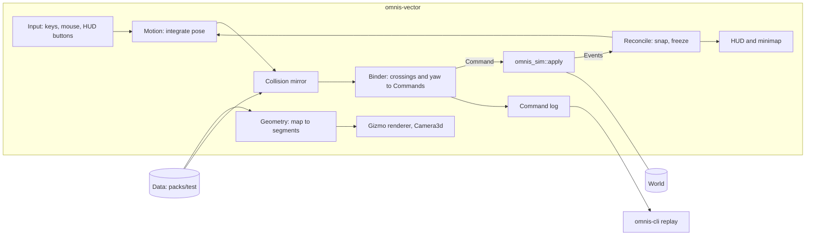

# Omnis Alt — 3D Presentation Experiment Architecture

| | |
|---|---|
| Status | Draft v0.2 (2026-10-02: wall height, bloom and packs settled), derived from `alt-PRD.md` v0.2 |
| Branch | `gui-3d-experiment` |
| Parent documents | `alt-PRD.md`, and for everything not restated here `ARCHITECTURE.md` (v0.3) |

Section and decision numbers prefixed X refer to `alt-PRD.md`. Decisions made here are numbered
VA1 onward (§13).

## 1. Principles

1. **The simulation is authoritative.**
   - `omnis-vector` changes the world only through `omnis_sim::apply(&mut World, &Data, Command)`.
   - It reads the world only through `World`, queries and the returned `Event`s.
   - No rule (movement legality, time, encounters, the automap) is implemented here. The one exception is a *predictive* collision mirror (§5.4), which the simulation still overrules and a test holds to agree with it.
2. **Floats stop at the boundary.** Poses, cameras and geometry use `f32`. What crosses into the simulation is `Command` values, which are integer enums. `omnis-vector` is not a simulation crate and is not added to `scripts/lint-sim.sh`.
3. **A Bevy-free core and a thin Bevy shell,** as in `omnis-app`.
   - The grid binding, collision, geometry extraction and command log are plain Rust modules with no `bevy` import.
   - Those modules are tested headless against the real `packs/test` maps.
   - Bevy plugins only move data between the core and the screen.
4. **No edits to main crates.**
   - The only changes outside `crates/omnis-vector` are its line in the root `Cargo.toml` member list, the root `[workspace.dependencies]` entry if one is wanted, and `Cargo.lock`.
   - If the experiment needs something from `omnis-sim` that is not public, that need is reported, not patched in.

## 2. System overview



## 3. Crate and dependencies

`crates/omnis-vector` holds a library (the core and the plugins) and a binary (`main.rs`).

```toml
[dependencies]
omnis-sim = { workspace = true }   # reaches omnis_data and omnis_core through its re-exports
bevy = { workspace = true, features = ["2d", "png", "bevy_pbr", "ui"] }
```

- **`2d`** already provides `bevy_render`, `bevy_core_pipeline`, `bevy_camera` (which holds `Camera3d`), `bevy_gizmos`, `bevy_gizmos_render`, `bevy_post_process` and `default_font`. These were read from the Bevy 0.19.1 manifest on 2026-10-02.
- **`bevy_pbr`** is the smallest addition that draws gizmos through a `Camera3d`. `bevy_gizmos_render` compiles its 3D pipeline (`pipeline_3d.rs`) only under its `bevy_pbr` feature, and `bevy_internal`'s `bevy_pbr` feature turns that on (`bevy_gizmos_render?/bevy_pbr`). It also brings `bevy_light` and `bevy_material`, which later meshes need anyway.
- **The full `3d` group is not used.** It adds `bevy_gltf`, `ktx2`, `zstd_rust`, the SMAA and tonemapping LUTs, morph animation and `bevy_anti_alias`, none of which vector lines need.
- **Tonemapping LUTs are not needed either.** The camera sets `Tonemapping::None`, because the default TonyMcMapface tonemapper needs `tonemapping_luts`.
- **`ui`** is for the HUD's text and buttons (§8). Its cost is measured with the rest (§11). If it is too costly, the fallback is `Text2d` on an overlay `Camera2d`, which `2d` already provides, with buttons hit-tested by hand.
- **No other dependencies.** The command log is written through `ron`, which `omnis-sim` already uses for replays, via `Replay::record`. Nothing else is planned.

## 4. Coordinates

The ground is Bevy's X–Z plane. Y is up, and the camera's forward is −Z by default.

| Simulation | World space |
|---|---|
| Cell `(x, y)` | The square `x ≤ X < x+1`, `y ≤ Z < y+1`; its centre is `(x + 0.5, y + 0.5)` |
| North (−y) | −Z |
| East (+x) | +X |
| South (+y) | +Z |
| West (−x) | −X |
| Facing | The cardinal direction nearest the yaw. Yaw 0 looks north (−Z), and positive yaw turns counter-clockwise seen from above (Bevy's `rotation_y`), so +90° looks west |

- One cell is 1.0 world unit.
- The wall height is 1.0 (owner, 2026-10-02), read through `geom::wall_height`, so it can vary later. The eye height is 0.5, provisional (alt-PRD §10.1). Both live in `geom.rs`.

## 5. The Bevy-free core

| Module | Responsibility | Key items |
|---|---|---|
| `geom.rs` | World-space constants and conversions | `CELL`, `EYE_HEIGHT`, `wall_height(&Terrain)`, `cell_centre(x, y)`, `yaw_of(Facing)`, `facing_vector(Facing)` |
| `pose.rs` | The continuous pose and its integration | `Pose { x, z, yaw }`, `Motion { forward, strafe, turn }` in units per second |
| `grid.rs` | Pure grid math | `cell_of(pose) -> (i32, i32)`, `facing_of(yaw, current, hysteresis) -> Facing`, `relative(abs: Facing, facing: Facing) -> Direction`, `turns_between(from, to) -> [Rotation; ≤2]`, `crossings(a, b) -> ≤2 ordered (Facing)` |
| `collide.rs` | The predictive collision mirror | `blocks(data, world, cell, abs: Facing) -> Option<BlockReason>`, `slide(pose, delta, blockers) -> Pose` |
| `bind.rs` | The binder: pose changes to commands, applied, then reconciled | `Binder { logical: Position, margin }`, `Binder::advance(&mut World, &Data, from: Pose, to: Pose) -> Outcome` |
| `geometry.rs` | Map data to line segments | `Segment { a: [f32; 3], b: [f32; 3], kind: SegKind, rgb }`, `extract(map, state) -> Vec<Segment>` |
| `party.rs` | The fixed party | `fixed() -> Vec<Draft>`: four base-pack drafts |

As built, the command log is `Binder.log`, with `Binder::replay`; there is no separate `log.rs`.

### 5.1 Facing and turns
- `facing_of` keeps the current cardinal facing until the yaw is more than 45° plus a hysteresis margin (5° provisional) away from it, so a yaw near a diagonal does not emit `Turn`s back and forth.
- When the facing changes, the binder emits one `Turn(Left | Right)` per 90°. A 180° change emits two turns in the yaw's direction of travel.
- Turns are always emitted before any step in the same frame (alt-PRD §4.1).

### 5.2 Cell entry
- The binder's `logical` cell is the simulation's position. The pose's raw `cell_of` can differ from it while the pose is within `margin` (0.15 provisional) of a boundary: the hysteresis of alt-PRD §4.3.
- A crossing is recognised when the pose leaves the logical cell's square expanded by `margin` on that side.
- Each crossing becomes `Step(relative(abs, world.position.facing))`.

### 5.3 Diagonal crossings
- Motion is sub-stepped so that no single integration step moves more than 0.25 of a cell. A sub-step can therefore cross at most two boundaries.
- `crossings(a, b)` orders the two crossings by their parameter `t` along the segment `a → b`, and the binder applies them in that order.
- If the first step is refused, or would be blocked by the mirror, the pose slides along that edge and the second crossing is re-evaluated from the slid pose. Doing this never produces a step the simulation would not take.

### 5.4 The collision mirror
- `blocks` reproduces the refusal conditions of `omnis_sim::apply::move`, in the same order:
  - the map edge
  - a wall on the edge
  - a closed door, from `MapState::door_open`
  - a target cell missing from the map
  - impassable terrain in the target cell
- These conditions are a copy of simulation logic. A copy is the risk this design accepts, so it is held by an **agreement test** (§10.2): for every cell and every edge of every map in `packs/test`, with doors both open and closed, `blocks(...)` is `Some(reason)` exactly when `apply(Step)` produces `Event::Blocked { reason }` with the same reason.
- If the main build changes `move`, that test fails on the next merge.
- `slide` removes the component of the motion into a blocking edge, keeping the pose a body radius (0.2 provisional) inside it.

### 5.5 Reconcile
After each `apply`, the binder reads the events and the mode, applying the first rule that matches:

| Observation | Action |
|---|---|
| `Err(Rejection)` | The command is not logged. The pose is pushed back to the logical cell. This should not happen in Explore; it is counted and shown on the HUD |
| `Event::Blocked { reason }` | The mirror disagreed with the simulation. The pose is pushed back, the reason is shown on the HUD, and the event is counted. The agreement test makes this a bug |
| Two `Event::Moved` (a portal) | The pose snaps to the final position's cell centre, and the yaw to its facing |
| `world.mode` is not `Explore` | Motion freezes. The pose settles to the logical cell's centre. The view state becomes `Fight` (§9) |
| A single `Event::Moved` | `logical` follows `world.position`. The pose is untouched, so movement stays continuous |

When the view state returns to `Explore`, the pose snaps to `world.position`. This covers the
retreat of Run and flight, which move the party back one cell, facing away.

### 5.6 The command log
- Every command that returned `Ok`, blocked steps included, is appended in order. Party setup commands are logged too, because a replay starts from `World::new` with the same seed and settings.
- Rejected commands are never logged, because `omnis_sim::replay` fails on a refused command (`ReplayError`).
- `Session::save_log` builds a `Replay` through `Binder::replay` (`Replay::record`) and writes it as RON. The default path is `.omnis/vector-session.ron`. The save button arrives in A7.

## 6. The Bevy shell

As built (A6, 2026-10-02), the systems run in `Update` in the chained sets
`VectorSet::{Grab, Input, Move, Draw}`, which `ShellPlugin` orders. One `Session` resource
(`shell/session.rs`) holds the `Data`, the `World`, the `Binder`, the pose, the seed and
settings, the log path, the HUD lines, a `reshape` flag and the `Config` it started from.
`Session::start` loads the packs, starts the world and creates the fixed party (§9).
`Session::order` applies a command that is not movement and snaps the pose to the
simulation's cell when the command moved the party (a retreat); `Session::restart` starts over
from the same `Config`.

| Plugin | Set | Does |
|---|---|---|
| `MovementPlugin` | Input, Move | Turns keys and the mouse into an `Intent` resource. the extended WASD layout (A7e): W/S and ↑/↓ move, A/D sidestep, ←/→ turn, Q/E turn 90°, and the mouse gives yaw while the cursor is grabbed. Then it integrates the pose, scaled by the terrain's `step_minutes`, calls `Binder::advance`, eases a stopped pose into the simulation's cell, and notes the events. Headless-safe |
| `ControlsPlugin` | Input | The buttons (A7a, A7d, `shell/controls.rs`): the movement pad bottom left (forward, back and the sidesteps while held; the quarter turns once a press), and actions (the menu), save log and quit bottom right. The keys are shortcuts for the same actions. Headless-safe |
| `PanelPlugin` | Input | The centre panel (A7b, A7e, `shell/panel.rs`): the fight notice (`shell/fight.rs`, §9) while the mode is not `Explore` or the party has fallen, otherwise the action menu (`shell/actions.rs`, §8) when open. Space toggles the menu; Shift+Space runs the default action, or opens the menu when there is none; Esc closes it, and so does moving. Number keys pick the choices. The shared types are in `shell/notice.rs`. Headless-safe |
| `RenderPlugin` | Grab, Draw | Click grabs the cursor and Esc releases it; a notice releases it and keeps it free. Spawns a `Camera3d` (`IsDefaultUiCamera`, `Tonemapping::None`, `Hdr`, `Bloom`), rebuilds the line segments on a map change or a door move, follows the pose, and draws with `Gizmos` |
| `HudPlugin` | Draw | `bevy_ui` status text (`default_font`) and the recent event lines |
| `CapturePlugin` | PreStartup, Input | `--screenshot PATH [--walk FRAMES] [--size WxH]`: renders offscreen into an image (no window, `ScheduleRunnerPlugin`), walks, captures, exits |
| `MinimapPlugin` | Draw | The minimap (A7c, §8): `minimap::paint` uploaded into a small `Image` shown as a UI node. Needs `Assets<Image>`, so a window or the offscreen capture |

A chosen action (for example `Command::Interact`) goes through `Session::order`, which applies
it through the binder, so it is logged. It applies to the simulation's facing, which the HUD
shows.

## 7. Rendering

### 7.1 Geometry
`geometry::extract` turns one map into segments:
- **A wall on an edge:** the four lines of a 1.0 × 1.0 vertical rectangle. A wall shared by two cells is emitted once, because edges are canonicalised to the north and west sides.
- **A door:** the frame's rectangle plus a centre panel when it is closed, or a frame only when it is open (`MapDef.door_open`).
- **A `block` terrain cell:** the twelve edges of a box.
- **The floor:** grid lines at cell boundaries in a dim colour. The ceiling is drawn only where the terrain declares one.
- **Colour:** from the terrain's `color`, with a fixed colour per edge kind.

Segments are extracted again only when the map changes or `Event::Door` arrives.

### 7.2 Drawing
- **Immediate mode first.** Each frame, the segments within the draw distance are drawn with `gizmos.line` in a colour whose alpha falls off linearly between the fog start and the fog end.
  - The fog end is the visibility depth of the party's cell, `Terrain.visibility_depth`, in cells (D16). The fog start is half of it.
  - Bevy's `DistanceFog` is a PBR material effect and is not assumed to apply to gizmos, so the fade is computed per line.
- **Retained mode is the fallback.** If immediate mode costs too much at the ultrawide, static walls move to a retained `GizmoAsset` with a constant colour, and only doors and the fade band stay immediate. This is decided by the measurement in §11, not up front.
- **Line width:** `GizmoConfig.line.width` in pixels, tuned on the 5120×1440 panel (XR4).

### 7.3 Camera
- First person at the eye height, with no pitch in Phase A: yaw only, for a direct mapping to facing. Mouse pitch is a later option.
- The field of view is set horizontally and converted per aspect, so 32:9 and 16:9 show the same vertical extent (alt-PRD §10.1).

## 8. HUD and minimap

- **Top-left text:**
  - the simulation's cell and facing
  - the mode
  - the party clock
  - the last event line (`Moved`, `Blocked`, `Door`, `EncounterStarted`)
  - the reconcile counters (rejections, mirror disagreements)
  - frames per second
- **Buttons (as built, A7a, A7d):** the movement pad bottom left (forward, back, strafe left, strafe right, turn left 90°, turn right 90°), and actions (the menu), save log and quit in their own group bottom right. Backgrounds are opaque, so the floor lines never cross a label. They follow the LESSONS rule that a button comes before a key; no function keys.
- **Action menu (as built, A7e; owner direction 2026-10-03):** Space opens the actions available on the party's square, facing the way it faces. Shift+Space runs the default action (the first available) or, when there is none, opens the menu. An action is listed only when the simulation, tried on a clone of the world, accepts it and does not answer `NothingHere`. The mechanics decide what appears, and this crate only names it. Today the one square action is `Interact`, labelled "Open the door" or "Close the door" from the faced edge. New square actions from the mechanics branch slot into `actions::available`.
  - The turn buttons animate the yaw by 90°, and the binder emits the `Turn`.
- **Minimap (as built, A7c):** top right, 192 pixels on its long side, in whole pixels per cell (at least two).
  - `minimap::paint` (Bevy-free) paints the current map's `world.automap` tiles: visited cells brighter than cells only seen, then walls and doors. Edges are canonical, as in `geometry::extract`, because the map may record a shared edge on one side only.
  - The party marker is a triangle at the *pose*, pointing along the yaw, so the gap between the continuous pose and the grid stays visible.
  - `shell/minimap.rs` uploads the pixels into an `Image` shown by an `ImageNode`. It repaints only when the map, the accepted-command count (the automap changes only on an accepted command), the marker's pixel or its heading (to 1/16 of a turn) changes.

## 9. View state, party, and combat

- `ViewState::{Explore, Fight}` follows `world.mode`: `Explore` for `Mode::Explore`, and `Fight` for `Encounter` or `Combat`.
- **Phase A, the fixed party.** The viewer builds a fixed party at start with `Command::Party(...)` commands, logged like any other command.
- **Phase A, the fight notice (as built, A7b).** No `ViewState` yet: `fight::notice` reads `world.mode` and `combat_view` each time the log grows. The 3D view stays up under a panel listing the living stacks.
  - In `Encounter`: Fight, Bribe (with the cost), Hide, Run.
  - In `Combat`: a placeholder until Phase B, so an accepted Fight never dead-ends. It offers Attack on each stack the acting member reaches, Dodge, and Flee.
  - When every member is down after a fight: Start again, which restarts the session (`Session::restart`). A fallen party does not walk.
  - Each choice is tried on a clone of the world. A refused one is drawn dim with the simulation's reason, so the binder's refusal count stays at zero.
- **Phase B, the 2D combat screen** (X7): on `OnEnter(ViewState::Fight)`, the `Camera3d` is deactivated and a `Camera2d` combat screen is spawned. It shows placeholder sprites for the stacks and the party, the action list, and the roll log, and sends `Command::Encounter` and `Command::Combat`. It is despawned on exit. Whether the menu model comes from `omnis-app`'s Bevy-free `combat_menu.rs` or is written fresh is alt-PRD §10.3, decided before Phase B.

## 10. Testing

All tests run under `scripts/verify.sh` with the rest of the workspace, and each is a real check
against the real packs. None is a mock.

### 10.1 Core unit tests
- `grid`: `cell_of` on boundaries and negative coordinates; `facing_of` hysteresis around each diagonal; `relative` for all sixteen pairs of facing and direction; `crossings` ordering for diagonal segments, including an exact corner hit (decided by a fixed tie-break, north/south first).
- `geometry`: segment counts for a small map, and shared walls emitted once.

### 10.2 Agreement test (collision mirror against the simulation)
For each map in `packs/test`, each cell and each of the four directions, the test places the party
with `Dev::Teleport` on a devtools world (or by setting the public `world.position`), applies
`Step`, and asserts that `collide::blocks` agrees with the simulation's `Event::Blocked` or
`Moved`, including the reason. Door edges are checked twice: closed, then opened with
`Command::Interact` while facing them. There is no `Dev` command for doors.

### 10.3 Binding tests (headless, scripted poses)
`Binder::advance` is driven along scripted pose paths on the real test maps, with no Bevy. It asserts:
- At rest, `cell_of(pose)` equals `world.position`, after straight walks, strafes, diagonal corner paths, and boundary jitter (a pose oscillating ±0.1 around a boundary for 100 frames emits zero or one step).
- Walking into a wall emits no step, and the pose slides.
- Entering the portal cell snaps the pose.
- Entering a placed encounter's cell puts the world into `Encounter` and freezes motion.
- On a random-table map, the number of `EncounterCheck` events equals the number of cells entered, never the number of frames.
- The log from each scripted session passes `Replay::check` and `replay::run`, reproducing the fingerprint (alt-PRD §7.4).

### 10.4 Shell smoke test
A `MinimalPlugins` app with `VectorSimPlugin`, `InputPlugin` and `MovePlugin`, and no render
plugins (as `omnis-app` excludes its render stack), takes synthetic key input for N frames and
checks that the world's position advanced. Rendering, the HUD and the frame rate are checked by
running the binary on the owner's display (alt-PRD §7.5).

## 11. Build impact and measurement

Recorded before and after the crate lands, as alt-PRD §7 asks:
- the `Cargo.lock` package count, and the new packages by name
- `scripts/check-duplicates.sh` output
- `scripts/verify.sh` wall time
- whether `cargo build -p omnis-app` changes (it should not, under resolver 3)
- the frame rate of the binary at 5120×1440 and 1920×1080, in immediate gizmo mode, on the largest test map

Sentrux `check_rules` runs on every commit, with the same caps as the main build: functions of at
most 100 lines, cyclomatic complexity of at most 25, no cycles.

## 12. Security

- **Input data:** only packs, loaded through `omnis_data::load_packs`, which treats them as untrusted (ARCH §6.2). `omnis-vector` reads no other files.
- **Output:** only the command log.
  - The default path is under `.omnis/`.
  - A `--log <path>` flag is accepted only for a relative path without `..` components, so a session cannot overwrite arbitrary files.
- **No network, no dev socket, and no `Dev` commands** reachable from player input in Phase A. The agreement test uses `Dev` on a test-only devtools world.
- **Inputs are bounded:** the mouse delta per frame is clamped, and the frame `dt` is clamped (0.1 s maximum) before integration, so a stall cannot teleport the pose across several cells. Sub-stepping handles the rest.

## 13. Decisions

| # | Decision | Alternatives | Rationale |
|---|---|---|---|
| VA1 | Bevy features `2d`, `png`, `bevy_pbr`, `ui`; no `3d` group | The full `3d` group; `2d` only with hand projection | `bevy_pbr` is what enables the 3D gizmo pipeline; `3d` adds glTF, ktx2, zstd and LUTs that lines do not use (§3). |
| VA2 | A Bevy-free core (`grid`, `collide`, `bind`, `geometry`, `log`) | Logic inside Bevy systems | Headless tests on real maps without a GPU, matching `omnis-app`'s pattern. |
| VA3 | A predictive collision mirror, held by an exhaustive agreement test | Apply `Step` speculatively on a cloned `World`; no client collision, snapping after refusals | A clone per frame is costly and still needs a pose to slide. Without collision the pose walks into walls and snaps. The mirror is small, and the test makes drift loud. |
| VA4 | Immediate-mode gizmos with a per-line distance fade first; retained gizmos as a measured fallback | Meshes with line materials; retained from the start | It is the least code. The fade needs per-frame colour, and measurement decides. |
| VA5 | Log only `Ok` commands, blocked steps included | Log every attempt | `replay::run` fails on a refused command; blocked steps are accepted commands, and they change the `turn` counter. |
| VA6 | Cardinal facing with a hysteresis margin; turns before steps | Facing derived per step only | Relative step directions need the right facing, and hysteresis stops `Turn` spam near diagonals. |
| VA7 | Yaw-only camera in Phase A | Pitch from the start | Yaw maps directly to facing; pitch adds nothing the grid can use yet. |

## 14. Open questions

Carried from `alt-PRD.md` §10: the field of view and eye height, captures, the combat screen's
code, the automap in 3D, and what comes after the proof.

Resolved by the owner (2026-10-02):
1. **Wall height:** 1.0 × 1.0 to start, with room to vary later. The height is read through one function, `geom::wall_height(&Terrain) -> f32`, which returns 1.0 for now. Per-terrain heights or ceilings can arrive later without touching the extraction or the camera code.
2. **Glow:** Phase A uses `Bloom` on an HDR `Camera3d`, which adds no crates (§6).
3. **Packs:** both, loaded together as the game does (`--pack packs/base --pack packs/test`). `packs/base` holds the rules, classes and monsters and has no maps, so the maps walked are the test pack's `dungeon` and `meadow`. The fixed party is built from base-pack drafts.
