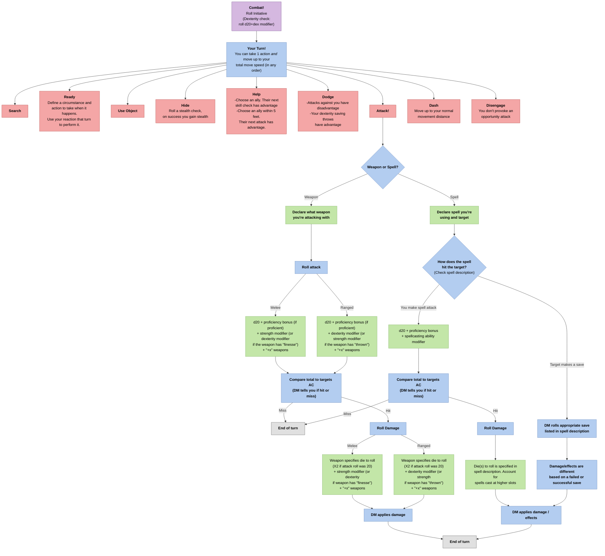

```mermaid
flowchart TD
    Start["<b>Combat!</b><br/>Roll Initiative<br/>(Dexterity check:<br/>roll d20+dex modifier)"]
    Turn["<b>Your Turn!</b><br/>You can take 1 action <i>and</i> move up to your<br/>total move speed (in any order)"]

    Search["<b>Search</b>"]
    Ready["<b>Ready</b><br/>Define a circumstance and<br/>action to take when it happens.<br/>Use your reaction that turn to perform it."]
    UseObject["<b>Use Object</b>"]
    Hide["<b>Hide</b><br/>Roll a stealth check,<br/>on success you gain stealth"]
    Help["<b>Help</b><br/>-Choose an ally. Their next<br/>skill check has advantage<br/>-Choose an ally within 5 feet.<br/>Their next attack has advantage."]
    Dodge["<b>Dodge</b><br/>-Attacks against you have disadvantage<br/>-Your dexterity saving throws<br/>have advantage"]
    Attack["<b>Attack!</b>"]
    Dash["<b>Dash</b><br/>Move up to your normal<br/>movement distance"]
    Disengage["<b>Disengage</b><br/>You don't provoke an<br/>opportunity attack"]

    Start --> Turn
    Turn --> Search
    Turn --> Ready
    Turn --> UseObject
    Turn --> Hide
    Turn --> Help
    Turn --> Dodge
    Turn --> Attack
    Turn --> Dash
    Turn --> Disengage

    Attack --> WoS{"<b>Weapon or Spell?</b>"}

    %% Weapon branch
    WoS -- Weapon --> DeclareWeapon["<b>Declare what weapon<br/>you're attacking with</b>"]
    DeclareWeapon --> RollAttack["<b>Roll attack</b>"]
    RollAttack -- Melee --> MeleeAtk["d20 + proficiency bonus (if proficient)<br/>+ strength modifier (or dexterity modifier<br/>if the weapon has #quot;finesse#quot;)<br/>+ #quot;+x#quot; weapons"]
    RollAttack -- Ranged --> RangedAtk["d20 + proficiency bonus (if proficient)<br/>+ dexterity modifier (or strength modifier<br/>if the weapon has #quot;thrown#quot;)<br/>+ #quot;+x#quot; weapons"]
    MeleeAtk --> CompareW["<b>Compare total to targets AC<br/>(DM tells you if hit or miss)</b>"]
    RangedAtk --> CompareW
    CompareW -- Miss --> EndMiss["<b>End of turn</b>"]
    CompareW -- Hit --> RollDmgW["<b>Roll Damage</b>"]
    RollDmgW -- Melee --> MeleeDmg["Weapon specifies die to roll<br/>(X2 if attack roll was 20)<br/>+ strength modifier (or dexterity<br/>if weapon has #quot;finesse#quot;)<br/>+ #quot;+x#quot; weapons"]
    RollDmgW -- Ranged --> RangedDmg["Weapon specifies die to roll<br/>(X2 if attack roll was 20)<br/>+ dexterity modifier (or strength<br/>if weapon has #quot;thrown#quot;)<br/>+ #quot;+x#quot; weapons"]
    MeleeDmg --> DMApplyW["<b>DM applies damage</b>"]
    RangedDmg --> DMApplyW

    %% Spell branch
    WoS -- Spell --> DeclareSpell["<b>Declare spell you're<br/>using and target</b>"]
    DeclareSpell --> HowHit{"<b>How does the spell<br/>hit the target?</b><br/>(Check spell description)"}
    HowHit -- You make spell attack --> SpellAtk["d20 + proficiency bonus<br/>+ spellcasting ability modifier"]
    SpellAtk --> CompareS["<b>Compare total to targets AC<br/>(DM tells you if hit or miss)</b>"]
    CompareS -- Miss --> EndMiss
    CompareS -- Hit --> RollDmgS["<b>Roll Damage</b>"]
    RollDmgS --> SpellDmg["Die(s) to roll is specified in<br/>spell description. Account for<br/>spells cast at higher slots"]
    HowHit -- Target makes a save --> DMSave["<b>DM rolls appropriate save<br/>listed in spell description</b>"]
    DMSave --> SaveEffects["<b>Damage/effects are different<br/>based on a failed or successful save</b>"]
    SpellDmg --> DMApplyS["<b>DM applies damage / effects</b>"]
    SaveEffects --> DMApplyS

    DMApplyW --> EndTurn["<b>End of turn</b>"]
    DMApplyS --> EndTurn

    classDef start fill:#d5b8e0,stroke:#7e5a96,color:#000
    classDef action fill:#f4a6a6,stroke:#b85450,color:#000
    classDef step fill:#b3cdf0,stroke:#6c8ebf,color:#000
    classDef roll fill:#c3e6a8,stroke:#82b366,color:#000
    classDef finish fill:#e0e0e0,stroke:#666,color:#000

    class Start start
    class Search,Ready,UseObject,Hide,Help,Dodge,Attack,Dash,Disengage action
    class Turn,WoS,RollAttack,CompareW,RollDmgW,DMApplyW,HowHit,CompareS,RollDmgS,DMSave,SaveEffects,DMApplyS step
    class DeclareWeapon,MeleeAtk,RangedAtk,MeleeDmg,RangedDmg,DeclareSpell,SpellAtk,SpellDmg roll
    class EndMiss,EndTurn finish
```